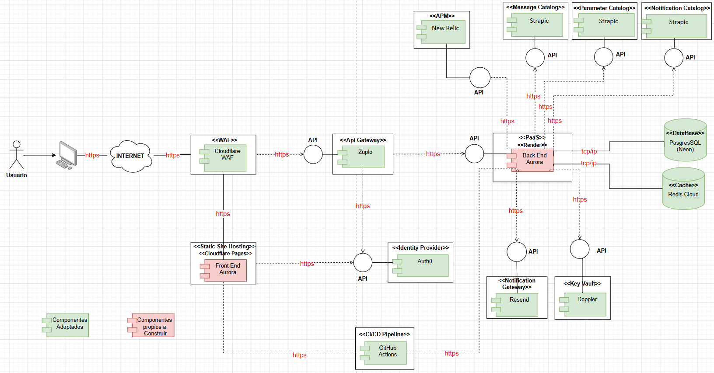
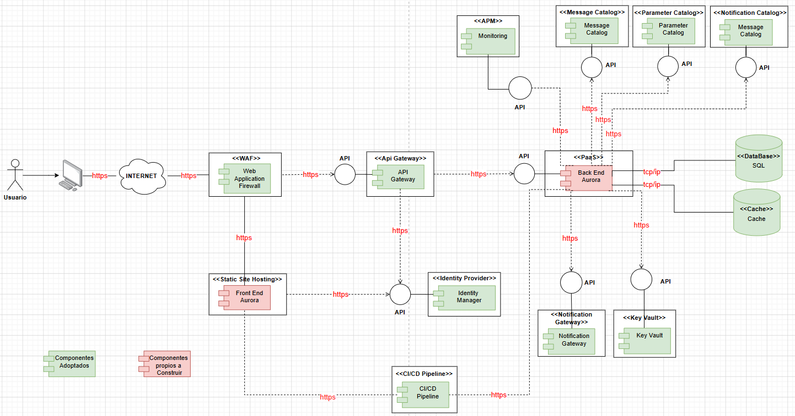

# **Documento de Arquitectura de Software**

## **Aurora**

**Integrantes:**

- [Juan Pablo Alzate Pulgarin]
- [Maria Camila Diaz Pinilla]

---

## **Introducción**

**Aurora** es una aplicación web diseñada para la gestión de inventario de pequeñas ferreterías en Colombia, permitiendo centralizar el control de ventas, clientes, inventario por lotes y fechas de vencimiento, y la administración de los empleados del negocio en una sola plataforma, eliminando la dependencia de hojas de cálculo y registros manuales.

Este documento describe la arquitectura de Aurora desde los siguientes puntos, siendo:

- **Despliegue:** define los componentes adoptados y desarrollados que conforman la solución, su ubicación dentro de la infraestructura y el como se relacionan entre ellos.
- **Componentes:** presenta los módulos lógicos del backend y el frontend, detallando las responsabilidades de cada uno y cómo se comunican entre sí para soportar la operación del sistema.
- **Paquetes:** describe la organización interna del código bajo una arquitectura en capas, estableciendo las dependencias permitidas entre ellas y los límites que garantizan la mantenibilidad y escalabilidad del sistema.
- **Secuencias:** f

## **1. Diagrama de Despliegue**

### **1.1 Descripción General**

El diagrama de despliegue representa la arquitectura física y lógica de Aurora, mostrando los servicios adoptados y desarrollados, así como su interacción.

Para esto, se tienen sus componentes princapales y posteriormente las bloques de construcción seleccionados para cumplir con cada componente

---

## **1.2 Componentes del Despliegue**

### **1.2.1 Componentes Principales Adoptados**

| Componente | Justificación |
| --- | --- |
| **Static Site Hosting** | Este componente actúa como el entorno de alojamiento especializado para el Frontend, enfocado exclusivamente en servir sitios web estáticos. A diferencia de los servicios de almacenamiento de objetos tradicionales o de propósito general, como por ejemplo un Bloc Store, los cuales requieren una configuración manual más compleja para que una aplicación web  funcione correctamente, una solución nativa de Static Site Hosting entiende por diseño que está sirviendo una aplicación web y gestiona todas estas configuraciones de forma automática. Dado que el Frontend se compone de archivos estáticos (HTML, CSS, JS) que el navegador del usuario descarga y ejecuta localmente, no requiere de un contenedor activo ni de poder de cómputo continuo, como sí lo necesitaría el Backend. Esto convierte al Static Site Hosting en la solución arquitectónica más eficiente, coherente y económica para el despliegue de la interfaz de usuario. Además, ayuda a cumplir los siguientes drivers arquitectónicos: ESC-CAL-DIS-0001, ESC-CAL-DIS-0002, RN-PRE-002 y RN-PRE-003 |
| **Web Application Firewall (WAF)** | El WAF es esencial para Aurora dado que el sistema maneja información sensible del negocio como ventas, inventario, precios de compra y venta, credenciales de los empleados y datos de los clientes. Este componente actúa como primera línea de defensa, interceptando solicitudes maliciosas antes de que siquiera alcancen el API Gateway, esto dado que Aurora es una aplicación web accesible desde internet, la exposición a estos tipos de ataques es un riesgo real, por lo que el WAF garantiza la reducción de la exposición del sistema ante ataques que puedan comprometer la integridad de los datos de la ferretería y ayuda a cumplir los siguientes drivers arquitectonicos: ESC-CAL-DIS-0001, ESC-CAL-SEG-0001 y RN-LEG-001. |
| **Identity Manager** | El Identity Management es esencial para Aurora para garantizar que al sistema solamente ingrese personal autorizado, ademas de hacer que cada empleado acceda únicamente a los módulos y funcionalidades correspondientes a su rol (Administrador, Vendedor u Operador de Inventario), este bloque es el que hace posible toda la logica del manejo del control de acceso al sistema. Cuando un usuario inicia sesión, el Identity Manager valida sus credenciales y si estas son validas, emite un token JWT firmado que incluye su identidad y rol, el sistema valida la identidad del usuario en cada petición posterior al API Gateway, por lo que este le permitira finalmente interactuar y realizar peticiones al sistema, por lo que este bloque evitando que cualquier persona no autorizada, no pueda entrar a la apliacación e interactue con la información del negocio, ademas de que ayuda a cumplir los siguiente drivers arquitectonicos: ESC-CAL-SEG-0001, ESC-CAL-SEG-0002, ESC-CAL-SEG-0003 y RN-LEG-001. |
| **API Gateway** | El API Gateway es un componente crítico en Aurora, es el guardián central del sistema, ya que toda la comunicación entre la interfaz del usuario de la ferreteria y la lógica del negocio pasa obligatoriamente por este componente, siendo que sus responsabilidades en el sistema son: validar el token JWT emitido por el Identity Manager antes de permitir el acceso a cualquier recurso, evitando la exposición directa de los servicios internos, ademas de gestionar el rate limiting para proteger el backend ante picos de tráfico, y centralizar el versionamiento de la API, ya que es el unico punto de acceso hacia la logica de negocio del sistema, ademas de que ayuda a cumplir los siguientes drivers arquitectonicos: ESC-CAL-DIS-0001, ESC-CAL-DIS-0002, ESC-CAL-SEG-0002, ESC-CAL-ESC-0007, RT-MAR-002, RT-DEV-002 y RN-PRE-002. |
| **Application Performance Monitoring (APM)** | La instrumentación y monitoreo son esenciales, ya que en la documentación de  nuestro sistema definimos compromisos precisos de rendimiento y disponibilidad que deben poder verificarse objetivamente, por lo que el monitoring es el bloque que hace posible esa verificación, esta tiene una naturaleza de observación al backend y al API Gateway, recibiendo metricas de forma pasiva sin interrumpir el flujo de las operaciones del negocio, permitiendo detectar de forma temprana degradaciones de rendimiento, caídas de servicios o anomalías en el consumo de recursos. Gracias a esta capa, es posible verificar en tiempo real que los tiempos de respuesta definidos en la matriz de tiempos se estén cumpliendo, identificar el origen de fallos sin depender del reporte del usuario y garantizar que el sistema se ha mantenido disponible durante el horario laboral de la ferretería, ademas de ayudar a cumplir los siguientes drivers arquitectonicos: ESC-CAL-REN-0001, ESC-CAL-DIS-0001, ESC-CAL-DIS-0002 y RT-DEV-001. |
| **PaaS (Plataform as service)** | La Plataforma como Servicio (PaaS) es el entorno gestionado que se encarga de alojar, ejecutar y administrar el ciclo de vida de las aplicaciones del sistema, en nuestro caso, el de nuestro Backend. Este componente abstrae la complejidad de la infraestructura subyacente, proporcionando el entorno automatizado necesario para que los artefactos de software (que contienen la lógica de negocio, dependencias y configuraciones) funcionen correctamente. La plataforma se encarga de proveer los recursos, levantar los servicios, supervisar su ejecución y reiniciarlos automáticamente en caso de fallos. Al delegar el despliegue y la ejecución a través de esta capa, se garantiza una alta consistencia en el comportamiento del sistema entre los entornos de pruebas y producción, mitigando errores derivados de incompatibilidades de entorno. Además, simplifica drásticamente el proceso de integración y despliegue de nuevas versiones, permitiendo una recuperación ágil ante incidentes y asegurando que el sistema mantenga un entorno de ejecución limpio, estable y fácil de operar sin la necesidad de administrar servidores manualmente, además de ayudar a cumplir los siguientes drivers arquitectónicos: ESC-CAL-REN-0001, ESC-CAL-DIS-0001, ESC-CAL-DIS-0002, ESC-CAL-ESC-0007, RT-DEV-001, RT-DEV-002 y RN-TIE-003. |
| **Database** | a base de datos es el núcleo de información de Aurora y el componente que garantiza la integridad de los datos del negocio almacenando ventas, inventario, lotes, clientes, usuarios, trazabilidad y auditoría. Al ser relacional, permite definir restricciones de integridad referencial, garantizando la consistencia de los datos del negocio incluso en operaciones concurrentes de múltiples usuarios simultaneamente, ademas de ayudar a cumplir los siguientes drivers arquitectonicos: ESC-CAL-DIS-0001, ESC-CAL-TRA-0011, ESC-CAL-ESC-0007, RF-VEN-06 y RN-PRE-002. |
| **Cache** | El caché de datos es fundamental para que Aurora almacene temporalmente información consultada con alta frecuencia, como por ejemplo el catálogo de productos, que son de los datos más consultados en el sistema, cuando multiples usuarios operan de manera simultanea, estas consultas pueden saturar el servicio de base de datos y degradar los tiempos de respuesta. El caché almacena temporalmente los resultados de búsquedas frecuentes en memoria RAM, lo que ayuda  que se evite saturar la base de datos con solicitudes, mantener los tiempos de respuesta acordados a lo estipulado en la matriz de tiempos, ademas de ayudar a cumplir los siguientes drivers arquitectonicos: ESC-CAL-REN-0001, ESC-CAL-DIS-0001, ESC-CAL-ESC-0007, RT-DIS-002. |
| **Notification Gateway** | El Notification Gateway abstrae el canal de envios de correos del BackEnd, cuando el BackEnd necesita enviar un correo, como cuando se le enviaria un código de recuperación de contraseña cuando el usuario se le olvido su contraseña, le delega esta responsabilidad al Notification Gateway sin preocuparse por los protocolos, las credenciales del servidor de correo, los reintentos ante fallos y en general todo el manejo de la logica necesaria para el envio de correos. Esto mantienen al backend limpio y enfocado unicamente en la lógica de negocio, ademas de ayudar a cumplir los siguientes drivers arquitectonicos: RF-SEG-06, RN-PRE-001, RT-DIS-001. |
| **Key Vault** | El Key Vault funciona como la bóveda centralizada de Aurora para custodiar la información sensible de infraestructura que no debe almacenarse en el código fuente. Específicamente, almacena las credenciales de conexión a la base de datos y las credenciales de acceso hacia las demas APIs y servicios que usa la aplicación. Al centralizar estos secretos, el sistema separa la lógica del negocio de la gestión de configuraciones críticas, garantizando que el Backend acceda a los servicios de forma segura y auditable, evitando fugas de información y facilitando la rotación de contraseñas sin necesidad de modificar el código del BackEnd, ademas de ayudar a cumplir los siguientes drivers arquitectonicos: ESC-CAL-DIS-0002, RN-LEG-001, RT-DEV-002, RT-DIS-001. |
| **CI/CD Pipeline** | Aurora establece por propender a la adopción de integración continua, entrega continua y despliegue continuo, el CI/CD Pipeline es el bloque de construcción que hace esto posible, es la infraestructura que construye, prueba y entrega el sistema, cada vez que el equipo sube cambios al repositorio, el pipeline ejecuta automáticamente los tests unitarios y de integración antes de permitir que el código llegue a producción, construyendo la imagen del contenedor donde estara alojado el artefacto, ademas de permitir revertir los cambios a una versión anterior si algo llegara a fallar, ademas de ayudar a cumplir los siguientes drivers arquitectonicos: ESC-CAL-DIS-0001, ESC-CAL-DIS-0002, RT-DEV-001, RT-MAR-001, RN-TIE-003. |
| **Message Catalog** | El Catálogo de Mensajes centraliza todas las notificaciones, advertencias y mensajes del sistema.Para Aurora es importante gestionar esta gran cantidad de mensajes fuera del código fuente, para garantizar que la comunicación con el usuario sea estandarizada y clara ante cualquier eventualidad. Además, permite al equipo actualizar o corregir los textos sin la necesidad de modificar el código, recompilar o hacer un nuevo despliegue del backend, manteniendo la lógica de negocio limpia, ademas de ayudar a cumplir los siguientes drivers arquitectonicos: RT-COD-001, RT-DIS-001, RN-ALC-001. |
| **Parameter Catalog** | El Catálogo de Parámetros es el componente que almacena y organiza los datos variables del negocio que el sistema necesita para construir sus plantillas, como el identificador de una venta, el nombre de un empleado o la fecha de vencimiento de un lote. Sin este catálogo, esos datos estarían dispersos por el código, haciendo difícil su mantenimiento y propensos a errores. Al centralizarlos en un solo lugar y tenerlos validados por el compilador antes de ejecutarse, Aurora garantiza que la información que se muestra al usuario siempre sea correcta y consistente, sin necesidad de infraestructura adicional, y además ayuda a cumplir los siguientes drivers arquitectónicos: RT-COD-001, RT-DIS-001, RN-ALC-001. |
| **Notification Catalog** | El Catálogo de Notificaciones es el componente que centraliza todas las comunicaciones que Aurora envía a los usuarios, como la confirmación de una venta, una alerta de stock bajo o un aviso de producto próximo a vencer. Su valor está en que toda la lógica de cuándo y cómo se envía cada notificación vive en un solo lugar, por lo que si se necesita modificar o agregar una nueva, el cambio se hace ahí sin tocar ningún otro módulo del sistema. Esto mantiene el resto del Backend limpio y enfocado en la lógica del negocio, y además ayuda a cumplir los siguientes drivers arquitectónicos: RT-COD-001, RT-DIS-001, RN-ALC-001. |

### **1.2.2 Componentes Principales de desarrollo propio**

| Componente | Justificación |
| --- | --- |
| **Frontend** | El Frontend es la capa visual e interactiva del sistema, es la que los usuarios de la ferretería utilizaran para operar Aurora en su día a día, por lo que sin una interfaz construida a la medida de los flujos de trabajo reales del negocio, como por ejemplo el modulo de ventas, la gestión de inventario, la administración de reportes y empleados, ningún componente de la lógica de negocio podría ser utilizado por las personas que trabajan en la ferretería, por lo que su existencia es fundamental, porque es quien abstrae toda la complejidad técnica del sistema y la convierte en algo amigable, claro y operativo para los usuarios de la ferreteria, los cuales son los usuarios finales que utilizarán el sistema. Este componente no solo permite interactuar con las funcionalidades del sistema, sino que además es el responsable de presentar toda la información del negocio de manera comprensible: el catálogo de productos, el estado del inventario, las alertas de stock y vencimiento, los mensajes del sistema, los reportes y todo lo que Aurora tiene para ofrecer, por lo que es importante que esa información llegue al usuario de forma clara, en el momento adecuado y sin generar confusión, depende de un buen Frontend construido a la medida. Por todo esto, tener un Frontend bien desarrollado, diseñado específicamente para soportar todo lo que Aurora puede hacer, es esencial para que el sistema cumpla su propósito: brindar a los empleados de la ferretería una forma amigable, intuitiva y eficiente de interactuar con la aplicación y tomar decisiones acertadas sobre el negocio. |
| **Backend** | El Backend es el cerebro operativo de Aurora y el componente central del sistema, osea que es el responsable de procesar y hacer cumplir la gran mayoría de los requisitos funcionales documentados en el proyecto, ademas de la implementanción de  las reglas de negocio de la ferretería, como por ejemplo: el sistema FEFO para la salida de productos perecederos, las alertas automáticas de stock bajo y vencimiento, las validaciones de disponibilidad en tiempo real, el control transaccional del inventario, la gestión de roles y accesos, y todo lo demás que el sistema hace por el negocio, por lo que sin el Backend, o si este no funcionara correctamente, ninguno de los demás componentes adoptados tendría razón de existir, ya que este es el núcleo que le da vida al sistema y que convierte la arquitectura completa de Aurora en una solución real para los problemas de la ferretería. |

---

## **Plataformas Tecnologicas**

### **1.2.3 Bloques de Construcción Adoptados**

| Componente | Fabricante | Nombre Comercial | Versión | Tipo de Licenciamiento | Justificación |
| --- | --- | --- | --- | --- | --- |
| **Static Site Hosting** | Cloudflare | Cloudflare Pages | Última versión estable | Capa gratuita (Freemium) | En Aurora, Cloudflare Pages actúa como el componente de alojamiento del Frontend, siendo una plataforma especializada en servir sitios web estáticos. A diferencia de un Storage Account tradicional como Azure Blob Storage o Amazon S3, que son servicios de almacenamiento de objetos de propósito general que requieren configuración manual de permisos, CORS, tipos MIME y reglas de enrutamiento para que una SPA funcione correctamente, Cloudflare Pages es un servicio de Static Site Hosting que entiende que lo que está sirviendo es una aplicación web y gestiona todo eso automáticamente. Al tratarse de archivos estáticos que el navegador descarga y ejecuta localmente, no requieren de un contenedor activo como sí lo necesitaría el Backend, haciendo de Cloudflare Pages la solución más económica, eficiente y coherente para el alojamiento del Frontend de Aurora. |
| **Web Application Firewall (WAF)** | Cloudflare | Cloudflare WAF | Última versión estable | Capa gratuita (Freemium) | Se seleccionó el WAF (Web Application Firewall) de Cloudflare como la capa de seguridad perimetral para el proyecto Aurora, implementándose como un escudo integral delante de la aplicación alojada en Cloudflare Pages y de los servicios del backend. A diferencia de soluciones como AWS WAF o Azure WAF que requieren configuraciones de red complejas, balanceadores de carga adicionales y generan costos variables por inspección de tráfico, Cloudflare ofrece una protección en el "borde" (Edge) de la red global, esto permite filtrar el tráfico malicioso en nodos cercanos al usuario (como Bogotá y São Paulo) antes de que las peticiones alcancen la infraestructura del sistema, garantizando baja latencia y alta disponibilidad. Su motor de seguridad, basado en inteligencia colectiva global, mitiga automáticamente amenazas críticas como ataques de denegación de servicio (DDoS), inyecciones SQL y Cross-Site Scripting (XSS), protegiendo la integridad de la base de datos y la disponibilidad del catálogo en las ferreterías. La integración nativa con Pages asegura que el entorno del frontend no quede expuesto a ataques maliciosos. Esta elección permite delegar la ciberseguridad crítica a un líder global, manteniendo un control de costos eficiente mediante su modelo freemium y una gestión unificada desde una sola consola. |
| **Identity Manager** | Okta | Auth0 | Última versión estable | Capa gratuita (Freemium) | Se seleccionó Auth0  como la plataforma de gestión de identidades y accesos (IAM) para el proyecto Aurora, destacándose frente a alternativas como AWS Cognito, Azure AD B2C o el desarrollo de un sistema de autenticación propio. A diferencia de AWS Cognito y Azure AD B2C que, aunque son sistemans muy potentes, suelen tener configuraciones más rígidas y están profundamente vinculados a sus respectivos ecosistemas de nube, mientras que Auth0 ofrece una arquitectura cloud-agnostic (agnóstica a la nube) y una experiencia de desarrollador superior con una integración casi instantánea. Su plan gratuito es uno de los más generosos del mercado, permitiendo hasta 25,000 usuarios activos mensuales y el uso de múltiples factores de autenticación (MFA) sin costos iniciales. Frente a la opción de construir un sistema de seguridad propio, Auth0 elimina el riesgo técnico y la complejidad de gestionar de forma segura contraseñas y sesiones, implementando estándares abiertos como OAuth 2.0 y OpenID Connect que garantizan la interoperabilidad entre el frontend en Vue.js y el backend en Spring Boot. Además, proporciona funcionalidades avanzadas de seguridad , como la mitigación de ataques automatizados mediante CAPTCHAs integrados, la detección de accesos anómalos basada en machine learning y la facilidad de implementar inicios de sesión sociales o Single Sign-On (SSO). Esta elección permite al equipo de Aurora delegar la seguridad crítica a un líder de la industria, reduciendo la deuda técnica y garantizando que el sistema sea escalable, seguro y eficiente financieramente. |
| **API Gateway** | Zuplo Inc | Zuplo | Última versión estable | Capa gratuita (Freemium) | Se seleccionó Zuplo como el API Gateway para Aurora por ser una solución nativa en la nube diseñada específicamente para desarrolladores, destacándose frente a alternativas como Kong Community Edition, AWS API Gateway o NGINX. A diferencia de Kong, que aunque es de código abierto requiere la configuración y mantenimiento de una infraestructura Docker adicional con base de datos PostgreSQL o Cassandra para gestionar su estado, Zuplo opera como un servicio completamente gestionado (SaaS) que no requiere ninguna infraestructura adicional. Frente a AWS API Gateway, que genera costos variables por millón de peticiones y ata la solución al ecosistema de Amazon, Zuplo ofrece una capa gratuita permanente con características de nivel empresarial. Su principal ventaja diferencial es su arquitectura edge-native, que ejecuta las políticas de enrutamiento y seguridad en nodos distribuidos globalmente. Integra de forma nativa la validación de tokens JWT emitidos por Auth0, el rate limiting configurable y el versionamiento de la API mediante un archivo de configuración declarativo en el repositorio de GitHub. |
| **Application Performance Monitoring (APM)** | New Relic Inc | New Relic | Última versión estable | Capa gratuita (Freemium) | Se seleccionó New Relic como la plataforma de APM y observabilidad para Aurora, descartando alternativas como Datadog, Dynatrace y AppDynamics. La decisión se fundamenta en su muy buena oferta tanto a nivel economico, como tecnico. A diferencia de Datadog, cuyo modelo de facturación modular cobra por separad, APM y logs, lo que generan costos impredecibles que penalizan proyectos en crecimiento como el nuestro, New Relic centraliza todas estas capacidades en una capa gratuita perpetua de 100 GB mensuales. Frente a Dynatrace, orientado a entornos corporativos complejos con presupuestos dedicados, New Relic ofrece una curva de adopción ágil y un agente Java altamente maduro. Este agente auto-instrumenta Spring Framework y expone métricas detalladas de la JVM (asignación de heap, recolección de basura, estado de hilos) sin modificar una sola línea de la lógica de negocio, bastando con inyectarlo como variable de entorno en el contenedor de Render. Además, su trazado de transacciones conecta latencias de endpoints con las consultas SQL exactas, y su potente lenguaje NRQL permite crear alertas proactivas para flujos críticos (ventas, alertas de stock y vencimientos), garantizando una observabilidad de grado empresarial a costo cero. |
| **PaaS (Platform as a Service)** | Render Inc | Render | Última versión estable | Capa gratuita (Freemium) | Se seleccionó Render como la plataforma PaaS (Platform as a Service) para el despliegue y gestión del ciclo de vida del backend de Aurora, destacándose frente a alternativas como Railway, Heroku o el despliegue manual en Kubernetes/VPS. En Aurora se hace uso en el desarrollo del Back End Java 26 con Spring Boot 4.0.6, siendo estas las versiones de estas tecnolpogias que se usaran para el desarrollo del mismo, por lo que usar herramientas como Railway, nos limitaba el entorno nativo a Java 21, Render elimina esta barrera mediante su soporte de primera clase para Docker. Al proporcionar un Dockerfile en el repositorio, el equipo obtiene control absoluto sobre el entorno de ejecución y la versión exacta del JDK, sin sacrificar las ventajas de una plataforma gestionada. A diferencia del despliegue en un VPS o en Kubernetes que exige una alta carga operativa para gestionar redes y parches del sistema operativo, Render abstrae la infraestructura, permitiendo al equipo enfocarse en la lógica de negocio. Frente a Heroku, que eliminó su capa gratuita, Render ofrece un modelo freemium que se ajusta a las fases iniciales del proyecto para su lanzamiento e implementación, ofreciendonos instancias que garantizan la estabilidad en los tiempos de respuesta. Finalmente, su integración nativa con GitHub cierra el ciclo de CI/CD, automatizando el redespliegue ante cada push a la rama principal y consolidando una entrega continua fluida, moderna y sin fricciones. |
| **Database** | PostgreSQL Global Development Group / Neon Inc | PostgreSQL — Neon Serverless Postgres | 17 | Open Source / Capa gratuita (Freemium) | Se seleccionó PostgreSQL como el motor de base de datos relacional para el proyecto Aurora por su robustez industrial y pleno cumplimiento de las propiedades ACID, esenciales para garantizar la integridad absoluta en transacciones de ventas e inventario. Frente a alternativas como MySQL o MariaDB, PostgreSQL ofrece un soporte superior para tipos de datos complejos y una gestión de transacciones concurrentes mediante MVCC (Multiversion Concurrency Control), lo que permite resolver conflictos de stock en tiempo real, evitando que dos vendedores descuenten la última unidad simultáneamente. Para su alojamiento en la nube se seleccionó Neon como proveedor de PostgreSQL gestionado, destacándose frente a alternativas como Supabase, Render PostgreSQL o Railway PostgreSQL. A diferencia de Render PostgreSQL y Railway PostgreSQL, cuyas bases de datos gratuitas expiran a los 90 y 30 días respectivamente, Neon ofrece una capa gratuita permanente sin fecha de expiración y sin requerir tarjeta de crédito, garantizando la disponibilidad continua del servicio durante todo el ciclo de vida académico del proyecto. Frente a Supabase, que incluye múltiples servicios adicionales que no son requeridos por la arquitectura de Aurora, Neon se especializa exclusivamente en PostgreSQL gestionado, proveyendo exactamente lo que el sistema necesita sin complejidad operativa adicional. La integración con Spring Boot se realiza mediante la URL de conexión estándar de PostgreSQL que Neon proporciona, sin ningún cambio en el código de la aplicación. Su licencia de código abierto elimina costos de adquisición del motor, y el alojamiento en Neon garantiza la disponibilidad permanente de los datos durante el desarrollo y la entrega del proyecto. |
| **Cache** | Redis Ltd | Redis Cloud | Última versión estable | Capa gratuita (Freemium) | Se seleccionó Redis Cloud como la solución de almacenamiento de datos en memoria caché para el proyecto Aurora, destacándose frente a alternativas como Memcached o servicios gestionados costosos como Amazon ElastiCache. A diferencia de Memcached que solo permite almacenar cadenas de texto simples, Redis ofrece soporte nativo para estructuras de datos avanzadas (hashes, listas, conjuntos y strings), lo que permite al Back End en Spring Boot gestionar no solo caché de consultas, sino también sesiones de usuario y colas de eventos de forma eficiente y, frente a soluciones como Amazon ElastiCache, que generan costos por hora desde el primer momento de utilizarce, Redis Cloud ofrece una capa gratuita (Free Tier) totalmente administrada, ideal para la fase de desarrollo y validación del sistema sin inversión inicial. Su integración con el ecosistema Spring Boot es nativa a través de Spring Data Redis, permitiendo mantener los "datos en caliente" fuera de la base de datos relacional principal, reduciendo drásticamente la latencia de respuesta. Esta elección garantiza una experiencia de usuario fluida para las ferreterías, optimizando los recursos de infraestructura y asegurando la escalabilidad del sistema ante picos de tráfico. |
| **Notification Gateway** | Resend Inc | Resend | Última versión estable | Capa gratuita (Freemium) | Se seleccionó Resend como el proveedor del Notification Gateway para el proyecto Aurora, destacándose frente a alternativas como Brevo, SendGrid o Mailgun. A diferencia de Brevo y SendGrid, cuya integración con Spring Boot se realiza mediante configuración SMTP tradicional con JavaMailSender, Resend ofrece una API REST moderna y limpia que simplifica significativamente el envío de correos desde el Backend, eliminando la necesidad de configurar protocolos SMTP, puertos y parámetros TLS de forma manual. Frente a SendGrid y Mailgun, que han acumulado deuda técnica en sus APIs y documentación a lo largo de los años, Resend fue construido desde cero con una experiencia de desarrollo (DX) de primer nivel, con una documentación clara, SDKs modernos y ejemplos específicos para Spring Boot que reducen drásticamente el tiempo de integración. Su plan gratuito de 100 emails diarios y 3.000 mensuales es más que suficiente para el volumen de notificaciones de Aurora en durante su fase de prueba en desarrollo y en producción, siendo la opción más viable y completa para implementar a nuestro sistema. |
| **Key Vault** | Doppler Inc | Doppler | Última versión estable | Capa gratuita (Freemium) | Se seleccionó Doppler como la solución de gestión centralizada de secretos (Key Vault) para el proyecto Aurora, destacándose frente a alternativas como Azure Key Vault, HashiCorp Vault self-hosted o la gestión manual mediante archivos de entorno (.env). A diferencia de Azure Key Vault, que aunque es robusto, requiere registrar la aplicación en Azure Active Directory, configurar manualmente quién puede acceder a qué recursos dentro del ecosistema de Microsoft e integrar librerías propietarias en el código antes de poder leer un solo secreto, Doppler ofrece un proceso de configuración en minutos donde los secretos se inyectan automáticamente como variables de entorno al contenedor sin necesidad de modificar el código de la aplicación. Frente a HashiCorp Vault self-hosted, que requiere un servidor dedicado y experiencia operacional avanzada que el equipo no posee, Doppler es un servicio completamente gestionado con un plan gratuito permanente que cubre la totalidad de los secretos necesarios para Aurora. Frente a la gestión manual con archivos .env, Doppler garantiza que nunca ninguna credencial sensible exista en el repositorio de GitHub ni en el sistema de archivos del servidor, cumpliendo el Factor III del Manifiesto de 12 Factores de Aplicación. |
| **CI/CD Pipeline** | Microsoft Corporation | GitHub Actions | Última versión estable | Capa gratuita (Freemium) | Se seleccionó GitHub Actions como la herramienta de Integración y Entrega Continua (CI/CD) para el proyecto Aurora, destacándose frente a alternativas del mercado como Jenkins, GitLab CI o CircleCI. A diferencia de Jenkins la cual exige aprovisionar, configurar y mantener un servidor dedicado para orquestar los despliegues, lo cual incrementando drásticamente los costos operativos, GitHub Actions ofrece una solución Serverless completamente administrada y, frente a herramientas de terceros como CircleCI, su mayor ventaja competitiva es la integración profunda y nativa con el repositorio donde ya reside el código fuente del proyecto (GitHub), permitiendo una automatización fluida basada en eventos (como commits o pull requests) sin configuraciones externas complejas. Para la arquitectura de Aurora, GitHub Actions actúa como el orquestador perfecto: permite automatizar la ejecución de pruebas del backend en Spring Boot y construir las imágenes en contenedores Docker. A nivel de seguridad operacional, destaca su capacidad para integrarse de manera fluida con un Key Vault; en lugar de almacenar credenciales de forma estática, el pipeline recupera e inyecta dinámicamente las variables de entorno sensibles (como los accesos a Auth0, Redis y la base de datos principal) garantizando un despliegue blindado. A nivel económico, su capa gratuita (Free Tier) proporciona minutos de ejecución y almacenamiento de artefactos más que suficientes para un proyecto en crecimiento, eliminando costos iniciales de licenciamiento. Esta elección garantiza entregas rápidas y confiables, consolidando un flujo de trabajo ágil y seguro. |
| **Message Catalog** | Strapi Solutions SAS | Strapi | Última versión estable | Capa gratuita (Freemium) | Se seleccionó Strapi (Strapi Cloud) como Catálogo de Mensajes para Aurora, descartando alternativas nativas como Spring MessageSource y soluciones SaaS como Contentful o Sanity. El criterio central fue permitir la edición dinámica de los textos del sistema sin requerir un redespliegue del Backend, separando el contenido del ciclo de vida del software y dejando puramente el código para nuestra lógica de negocio. Usar Spring MessageSource (archivos .properties) obliga a ejecutar el pipeline de CI/CD en Render ante cualquier corrección ortográfica, lo cual es ineficiente. Por otro lado, Spring Cloud Config Server exige operar un microservicio adicional, añadiendo una complejidad operativa mayor. Frente a plataformas comerciales como Contentful (cuyo plan base parte de $300/mes) o Sanity (que añade la curva de aprendizaje de GROQ), la capa gratuita permanente de Strapi resulta técnica y económicamente superior, además de ser amigable en su uso para desarrolladores sin mucha experiencia. Su integración con Spring Boot se realiza mediante peticiones REST sobre HTTPS. Para optimizar el rendimiento y evitar cobros extra, los mensajes se almacenan en la caché de Redis Cloud al arrancar el sistema, evitando así comprometer los tiempos de respuesta y respetando los límites del plan gratuito. |
| **Parameter Catalog** | Strapi Solutions SAS | Strapi | Última versión estable | Capa gratuita (Freemium) | Se seleccionó Strapi Cloud como Catálogo de Parámetros para Aurora, descartando el uso de Spring Data JPA + PostgreSQL y AWS Parameter Store. El objetivo fue disponer de una interfaz visual que permita gestionar valores clave del negocio sin intervención técnica ademas de usar una plataforma amigable hacia los pequeños desarrolladores. Usar Spring Data JPA obligaba a crear endpoints administrativos adicionales en el Backend, mezclando configuraciones con datos transaccionales de la logica de negocio. AWS Parameter Store fue descartado por generar dependencia de infraestructura (vendor lock-in). Frente a otros CMS más complejos, la interfaz de Strapi permite modelar esquemas en minutos de forma intuitiva y su capa gratuita cubre perfectamente las necesidades del proyecto. Su integración con Spring Boot se realiza mediante peticiones REST vía HTTPS. Al igual que con los mensajes, los parámetros se consultan al arrancar y se almacenan en Redis Cloud, garantizando disponibilidad inmediata para la lógica de negocio sin latencia adicional y maximizando el rendimiento del nivel gratuito de la plataforma. |
| **Notification Catalog** | Strapi Solutions SAS | Strapi | Última versión estable | Capa gratuita (Freemium) | Se seleccionó Strapi Cloud como Catálogo de Notificaciones para Aurora, descartando la combinación de Thymeleaf + Spring Application Events y plataformas como Storyblok. El criterio principal fue externalizar las plantillas visuales de los correos (HTML) para permitir su modificación sin tocar el código fuente. Usar Thymeleaf convierte un simple cambio de diseño o texto en un correo en un evento técnico que requiere redesplegar toda la aplicación en Render. Frente a Storyblok o Contentful (diseñados para marketing y con altos costos), el modelo estructurado de Strapi y su capa gratuita permanente son ideales para almacenar plantillas transaccionales con variables dinámicas. El Backend consulta la plantilla correspondiente vía HTTPS mediante REST, inyecta los datos dinámicos deseados para el correo y finalmente delega el envío a la API de Resend. Esta arquitectura mantiene el sistema limpio, altamente modular y separa por completo la presentación visual de la lógica de envío. |

---

### **1.2.4 Bloques de Construcción Desarrollados**

| Componente | Fabricante | Nombre Comercial | Versión | Tipo de Licenciamiento | Justificación | Motivación |
| --- | --- | --- | --- | --- | --- | --- |
| **Back End Aurora** (Lenguaje) | OpenJDK | Java | 26.0.1 | Open Source | Se seleccionó Java 26 como el lenguaje de programación del Backend de Aurora por ser la plataforma empresarial más madura y ampliamente adoptada para sistemas de gestión de negocio críticos. Frente a lenguajes interpretados como Python o PHP, Java ofrece tipado estático fuerte y compilación previa que detecta la mayoría de errores antes de llegar a producción, reduciendo drásticamente los fallos en tiempo de ejecución. Comparado con JavaScript (Node.js), cuyo modelo de un solo hilo puede convertirse en cuello de botella ante operaciones transaccionales pesadas y concurrentes como las de un sistema de inventario, Java gestiona la concurrencia mediante un modelo de hilos maduros que lo hace más adecuado para múltiples usuarios operando simultáneamente sobre los mismos datos. Frente a C#, que aunque comparte muchas fortalezas con Java en términos de tipado y rendimiento, su ecosistema está históricamente atado al entorno de Microsoft y Windows, mientras que Java es completamente multiplataforma y agnóstico a la infraestructura. En comparación con lenguajes más modernos como Go, Kotlin o Rust, Java cuenta con el ecosistema de frameworks empresariales más completo del mercado, siendo Spring Boot su exponente principal, lo que reduce el tiempo de desarrollo al proveer soluciones ya construidas para autenticación, transacciones, acceso a datos y APIs REST. Ruby, aunque expresivo, carece del rendimiento y la robustez de tipado necesarios para un sistema con compromisos estrictos de tiempo de respuesta. La elección de la versión 26 permite al equipo trabajar con las mejoras más recientes del lenguaje en cuanto a rendimiento, expresividad y características modernas de la plataforma, garantizando que el sistema sea desarrollado sobre una base tecnológica actualizada y alineada con las tendencias actuales del ecosistema Java. | El propósito de adoptar Java 26 en Aurora es que actúe como la base estructural sobre la cual se construye la totalidad del Backend del sistema. Su rol específico es ser el lenguaje mediante el cual se codifica y ejecuta toda la lógica de negocio de la ferretería: el sistema FEFO, el control transaccional de ventas, las validaciones de stock y todas las reglas que hacen que Aurora funcione de forma correcta y segura. Su tipado estático promueve contratos claros entre componentes, su orientación a objetos facilita la aplicación de los principios SOLID y los patrones de diseño definidos en las restricciones técnicas del proyecto, y al ser el lenguaje nativo de Spring Boot elimina cualquier fricción de integración, permitiendo al equipo enfocarse y concentrarse en las funcionalidades del negocio. |
| **Back End Aurora** (Framework) | Broadcom Inc | Spring Framework | 7.x | Open Source | Se seleccionó Spring Framework como el núcleo fundacional y estructural para el Backend de Aurora, descartando alternativas como el desarrollo puro sobre Jakarta EE. Como el "padre" de todo el ecosistema, Spring Framework proporciona el contenedor de Inversión de Control (IoC) y el patrón de Inyección de Dependencias (DI) que sustentan toda la aplicación. Su ventaja más competitiva radica en su arquitectura modular integral, que centraliza componentes críticos bajo un mismo estándar oficial; por mencionar algunos estarían: Spring Web para la exposición de la API REST, Spring Security para el manejo de autorizaciones con Auth0, y Spring Data para la gestión transaccional de inventarios. Al orquestar este ecosistema a través de Spring Boot 4.0.6, se automatiza la configuración sin perder la robustez del framework subyacente. Además, esta generación de Spring Framework está diseñada con soporte nativo para Java 26, permitiendo aprovechar capacidades y tecnologías modernas, manteniéndose a la vanguardia del avance tecnológico. Frente a competidores más recientes como Quarkus o Micronaut, Spring Framework domina como el estándar empresarial definitivo, ofreciendo la madurez necesaria para delegar la infraestructura y enfocar al equipo en la lógica de negocio de la ferretería. | El propósito de adoptar Spring Framework en el proyecto Aurora es que actúe como el motor estructural y fundacional del Backend. Su rol principal es proveer toda la infraestructura técnica automatizada para el desarrollo y, finalmente, la exposición de las APIs REST para que el mundo exterior pueda interactuar con el backend. Al delegar en este robusto ecosistema tareas complejas de bajo nivel como la inyección de dependencias, la conexión a la base de datos y la gestión de la seguridad, entre muchas otras, el equipo de desarrollo puede enfocarse exclusivamente en programar la lógica de negocio de la ferretería, facilitando y acelerando enormemente la construcción de un aplicativo estable y escalable. |
| **Back End Aurora** (IDE de Desarrollo) | JetBrains | IntelliJ IDEA Community Edition | 2026.1 | Open Source | Se seleccionó IntelliJ IDEA Community Edition como entorno de desarrollo frente a otras alternativas de código abierto como Eclipse, NetBeans o Visual Studio Code por ser uno de los mejores IDEAs estandar a la hora de tranajar con Java. A diferencia de otros como Eclipse o NetBeans, que a menudo requieren configuraciones extensas y una interfaz no tan amigable, IntelliJ ofrece una interfaz más amigable, ademas de que de forma nativa, ofrece un análisis estático de código superior que detecta errores y sugiere mejoras en tiempo real mientras se escribe. Frente a editores ligeros como VS Code, este IDE proporciona una comprensión semántica profunda del proyecto al estar trabajando con el lenguaje Java, facilitando refactorizaciones complejas y seguras, así como una navegación fluida por el código fuente, ademas de su integración nativa con herramientas de construcción como Maven y su excelente soporte para el motor de ejecución de Java, garantiza ofrecer uno de los mejores flujos de trabajo a la hora de realizar proyectos en este lenguaje. | IntelliJ IDEA nos proporciona a nosotros como al equipo de desarrollo, una estación de trabajo unificada para la construcción del sistema Aurora, por lo que su rol es actuar como la interfaz principal de codificación, donde sus herramientas de autocompletado inteligente y depuración servirán como el primer filtro de calidad del sistema. Al ayudarnos a identificar posibles bugs o ineficiencias de manera instantánea, el IDE asegura que el código del Backend sea robusto y cumpla con las mejores prácticas de programación desde su creación, permitiendo que nosotros como equipo nos enfoquemos principalmente en resolver la lógica de negocio del sistema, en lugar de lidiar con problemas de sintaxis. |
| **Back End Aurora** (Análisis de calidad de código) | SonarSource | SonarQube for IDE | 12.2.0 | Open Source | Se seleccionó SonarQube for IDE frente a alternativas de análisis estático como Checkstyle, PMD o SpotBugs por ofrecer la solución de retroalimentación más integral y rápida del mercado directamente en el entorno de desarrollo. A diferencia de Checkstyle (que se limita a convenciones visuales de estilo) o PMD (enfocado únicamente en patrones problemáticos), SonarQube for IDE unifica estas cualidades, brindando detección multidimensional de code smells, vulnerabilidades de seguridad y bugs potenciales mientras se escribe el código. Su mayor ventaja competitiva y técnica es su enfoque "Shift-Left": en lugar de esperar a que el código se envíe a un servidor o a un pipeline de CI/CD para ser evaluado, la herramienta analiza el código en tiempo real (como un corrector ortográfico avanzado), permitiendo al desarrollador solucionar problemas antes del commit. Esto reduce la fricción, evita subir código defectuoso al repositorio y acelera enormemente el ciclo de desarrollo. | El propósito de adoptar SonarQube for IDE en el proyecto Aurora es contar con un guardián automatizado de calidad que acompañe al equipo de desarrollo en tiempo real. Su rol fundamental es inspeccionar el código fuente directamente en el editor, detectando de manera temprana cualquier vulnerabilidad o mala práctica en el instante exacto en que se está programando. Con esta herramienta, se garantiza el cumplimiento de los estándares de Código Limpio (Clean Code) y principios SOLID desde la fase misma de escritura, asegurando la mantenibilidad, seguridad y escalabilidad del sistema de forma proactiva, sin depender de validaciones externas o ejecuciones en la nube. |
| **Back End Aurora** (Seguridad) | OWASP Foundation | OWASP Java HTML Sanitizer | Última versión estable | Open Source | Se seleccionó OWASP Java HTML Sanitizer como la librería de sanitización de entradas de texto para el Backend de Aurora, destacándose frente a alternativas como JSOUP o la validación manual mediante expresiones regulares. A diferencia de JSOUP, cuyo propósito principal es el parsing y manipulación de documentos HTML y no la sanitización de seguridad, OWASP Java HTML Sanitizer fue diseñado específicamente por la comunidad OWASP para eliminar contenido malicioso de las entradas del usuario antes de que sean procesadas o almacenadas. Su integración en Spring Boot es inmediata: se agrega como dependencia en el pom.xml y se invoca directamente en los métodos de servicio que reciben datos del usuario, sin ninguna configuración de infraestructura adicional. Al operar dentro del código del Backend, complementa la protección perimetral del WAF de Cloudflare con una validación en la capa de aplicación, implementando el principio de defensa en profundidad y cubriendo vectores de ataque XSS que podrían evadir el filtrado de red. | El propósito de adoptar OWASP Java HTML Sanitizer en Aurora es garantizar que ningún dato malicioso ingresado a través de los formularios del sistema (como el formulario de creación de clientes) pueda ser almacenado en PostgreSQL y posteriormente ejecutado en el navegador de otros usuarios como un ataque Cross-Site Scripting. Su rol concreto en el proyecto es actuar como el filtro de seguridad que procesa todas las entradas de texto libre antes de que el Backend las persista, asegurando que solo texto plano limpio llegue a la base de datos y sea devuelto al Frontend, protegiendo la integridad de la información del sistema y la seguridad de los empleados de la ferretería que lo operan. |
| **Back End Aurora** (Pruebas de seguridad) | OWASP Foundation | OWASP ZAP (Zed Attack Proxy) | Última versión estable | Open Source | Se seleccionó OWASP ZAP como la herramienta de pruebas de seguridad dinámica (DAST) para el pipeline de CI/CD de Aurora, destacándose frente a alternativas de pago como Burp Suite Pro o herramientas comerciales de escaneo. A diferencia de SonarQube, que analiza el código fuente en busca de vulnerabilidades potenciales, OWASP ZAP realiza pruebas de seguridad activas contra la aplicación en ejecución, simulando ataques reales para detectar vulnerabilidades del OWASP Top 10 como inyecciones SQL, XSS, exposición de datos sensibles o endpoints REST sin protección. Al ser completamente gratuito, de código abierto y ofrecer una imagen Docker oficial, se integra de forma nativa en el workflow de GitHub Actions como un paso automatizado que se ejecuta después de cada despliegue, escaneando la URL del sistema en el servidor de Railway y generando un reporte de seguridad sin intervención manual del equipo. | El propósito de adoptar GitHub es que funcione como repositorio central para todo el código fuente de nuestro sistema Aurora, siendo su rol fundamental, orquestar la colaboración asíncrona del equipo, permitiendo el desarrollo paralelo de funcionalidades, ademas de mitigar conflictos y garantiza la integridad de los componentes desarrollados a lo largo del ciclo de vida del proyecto. Al centralizar el historial de cambios y actuar como el disparador (trigger) de los flujos de automatización, GitHub asegura que cada modificación sea rastreable, reversible y esté sujeta a los estándares de calidad definidos antes de cualquier despliegue. |
| **Back End y Front End Aurora** (Controlador de versiones) | Microsoft Corporation | GitHub | Última versión estable | Capa gratuita (Freemium) | Se seleccionó GitHub frente a alternativas como GitLab o Bitbucket por consolidarse como el estándar actual en la industria y al ser la herramienta que ofrece el ecosistema más robusto para la colaboración técnica entre equipos. A diferencia de otros como GitLab, que suele imponer restricciones más estrictas en sus niveles gratuitos respecto a minutos de cómputo y herramientas de gestión, GitHub proporciona repositorios privados ilimitados y una cuota de 2,000 minutos mensuales en el uso de GitHub Actions. Frente a Bitbucket, GitHub destaca por poseer la comunidad global de desarrolladores más extensa, lo que asegura una disponibilidad inmediata de documentación y soporte en cualquier momento, ademas su factor diferencial  es la integración nativa de todo el ciclo de vida de desarrollo en una sola plataforma, permitiendo controlar todo el ciclo de vida de la aplicación, centralizado en un solo lugar. | El propósito de adoptar GitHub es que funcione como repositorio central para todo el código fuente de nuestro sistema Aurora, siendo su rol fundamental, orquestar la colaboración asíncrona del equipo, permitiendo el desarrollo paralelo de funcionalidades, ademas de mitigar conflictos y garantiza la integridad de los componentes desarrollados a lo largo del ciclo de vida del proyecto. Al centralizar el historial de cambios y actuar como el disparador (trigger) de los flujos de automatización, GitHub asegura que cada modificación sea rastreable, reversible y esté sujeta a los estándares de calidad definidos antes de cualquier despliegue. |
| **Front End Aurora** (Framework) | Evan You (Open Source) | Vue | 3.5.33 | Open Source | Se seleccionó Vue.js frente a alternativas como React o Angular por ofrecer el mejor equilibrio entre un ecosistema integrado y una curva de aprendizaje más amigable. A diferencia de React, la cual opera estrictamente como una librería de renderizado y requiere acoplar herramientas de terceros para el enrutamiento o la gestión de estados (como React Router o Redux), Vue.js proporciona un ecosistema oficial unificado (Vue Router y Pinia), y frente a frameworks robustos pero rígidos como Angular, Vue destaca por no imponer un sistema de módulos complejo, permitiendo una productividad más inmediata y amigable. Además, su patrón arquitectónico de Single File Component (SFC), que encapsula estructura (HTML), lógica (TypeScript/JavaScript) y diseño (CSS) en un solo archivo, resulta altamente intuitivo a la hora de programar. Esta cohesión técnica lo convierte en la opción óptima para maximizar la velocidad de desarrollo considerando los tiempos de entrega y el conocimiento tecnico del equipo de desarrollo. | El propósito de adoptar Vue.js en nuestro proyecto es que actúe como el motor estructural de la capa de presentación de la aplicación, es decir del Front End, lo que veran a diario los usuarios de la ferreteria. Su rol fundamental es orquestar y construir toda la interfaz de usuario interactiva en formato Single Page Application (SPA), abarcando los formularios de ventas, el catálogo de productos, la gestión de empleados, la gestión de inventarios, entre todos los demas. A través de su modelo de componentes, Vue permite aislar cada sección de la interfaz en unidades independientes y reutilizables, facilitando el trabajo en paralelo del equipo sin conflictos de código. Asimismo, su sistema de reactividad nativa será el responsable de garantizar que los cambios de los datos, se reflejen de manera oportuna en las pantallas de los diferentes usuarios de la aplicación. |
| **Front End Aurora** (Internacionalización) | Kazupon / Vue Core Team | vue-i18n | 11.x | Open Source | Se seleccionó vue-i18n como la solución de internacionalización para el Frontend de Aurora por ser la librería oficial del ecosistema Vue.js para la gestión de múltiples idiomas, con integración profunda y nativa con Vue 3 y su API de Composition. A diferencia de implementaciones manuales con objetos JavaScript o librerías genéricas como i18next, vue-i18n ofrece detección automática del idioma del navegador, cambio de idioma en tiempo real sin recarga de página y soporte para formatos de fecha, número y pluralización según la localidad del usuario. Frente a soluciones como FormatJS o LinguiJS, vue-i18n es la opción con mayor adopción y documentación dentro del ecosistema Vue, con soporte oficial del equipo del framework. Si bien Aurora operará inicialmente en español, adoptar vue-i18n desde el inicio garantiza que toda la capa de presentación esté construida sobre una arquitectura preparada para escalar a otros idiomas sin necesidad de refactorizaciones costosas. | El propósito de adoptar vue-i18n en Aurora es construir el Frontend desde su base con capacidad de soportar múltiples idiomas en el futuro, aunque en la primera versión opere exclusivamente en español. Su rol en el proyecto es centralizar todos los textos de la interfaz en archivos de traducción separados de los componentes Vue, garantizando que cuando se requiera agregar un nuevo idioma el cambio se limite únicamente a agregar un archivo de traducciones sin tocar ningún componente de la interfaz. Esto también mejora la mantenibilidad del sistema a corto plazo, ya que cualquier corrección de texto en la interfaz se hace en un solo lugar centralizado y no disperso por decenas de componentes. |
| **Front End Aurora** (Lenguaje) | Microsoft (OpenJS Foundation) | TypeScript | 5.9.3 | Open Source | La elección de TypeScript sobre JavaScript se debe a que JavaScript, al ser un lenguaje de tipado dinámico, deja demasiada libertad a los desarrolladores; TypeScript, en cambio, impone un tipado estático que mejora la robustez, la mantenibilidad y la seguridad del código frontend, debido que el copilador verifica antes de ejecutar el codigo, permite detectar errores incluso antes del que código corra, protegiendo así la integridad de la información que se presenta al usuario. , TypeScript es el estándar en el ecosistema Vue.js, siendo este un JavaScript, pero más moderno, seguro y robusto, con soporte nativo en todos los editores de código y herramientas de construcción del proyecto. | TypeScript cumple el rol en nuestro proyecto de garantizar la integridad de los datos entre el backend y el frontend de Aurora. Al poder definir interfaces TypeScript que representan las entidades del sistema, como por ejemplo serian los Productos, Lotes, Ventas, Clientes, entre otras, el compilador verifica que el frontend acceda únicamente a los campos que existen en la respuesta del backend y con el tipo de dato correcto esperado, esto siendo muy relevante en operaciones del día a día de la ferreteria, ya que un dato mal mostrado, puede generar inconsistencias en el flujo de trabajo de la ferreteria. |
| **Front End Aurora** (IDE) | Microsoft | Visual Studio Code | 1.117.0 | Open Source | Se seleccionó Visual Studio Code (VS Code) como el entorno de desarrollo para la capa del Front End, destacándose frente a alternativas como WebStorm o Atom. A diferencia de WebStorm (de JetBrains), este exige un pago de licencias comerciales comerciales para su uso, mientras VS Code es una herramienta gratuita y de código abierto respaldada por Microsoft, que ofrece buen rendimiento y varias herramientas sin costo. Frente a editores como Atom, el cual fue descontinuado en 2022, VS Code garantiza actualizaciones mensuales, ademas del apoyo de la comunidad de desarrolladores web más grande a nivel global. Su ventaja definitiva para el proyecto Aurora es su ecosistema de extensiones especializado en desarrollo web: ofrece soporte nativo para TypeScript y cuenta con herramientas oficiales como Volar (para el análisis de Vue.js), ESLint y SonarLint, lo que proporciona un análisis de código en tiempo real altamente preciso para el desarrollo del Frontend. | El propósito de adoptar Visual Studio Code es darnos una estación de trabajo ligera, rápida y altamente especializada para la construcción exclusiva del Frontend de muestra aplicación. Su rol fundamental es ser el entorno donde se orquestará toda la interfaz gráfica en Vue.js. Al estandarizar el uso de VS Code específicamente para la capa de presentación, se garantiza que todos los integrantes del equipo trabajen bajo las mismas reglas de formateo, las mismas alertas de calidad de código y la misma integración con el repositorio en GitHub.  Dondonos un entorno ligero, facil de usar, y con todas las herramientas necesarias pára el desarrollo y la construcción del front End de nuestra aplicación. |

---

### **1.3 Diagrama de Componentes del Despliegue - Bloques de construcción**

Este diagrama tambien corresponde al Arquetipo de Referencia de la aplicación.

### **1.3 Diagrama de Componentes del Despliegue - Plataformas Tecnologicas**

Este diagrama tambien corresponde ala Arquitectura de Referencia de la aplicación.

---
