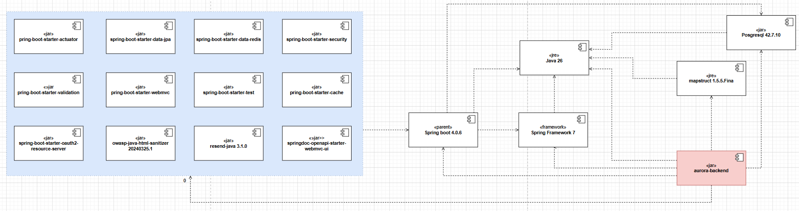
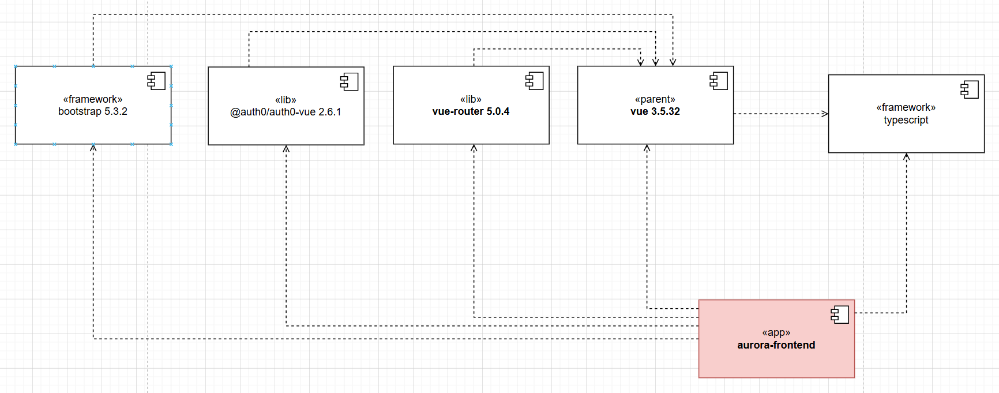
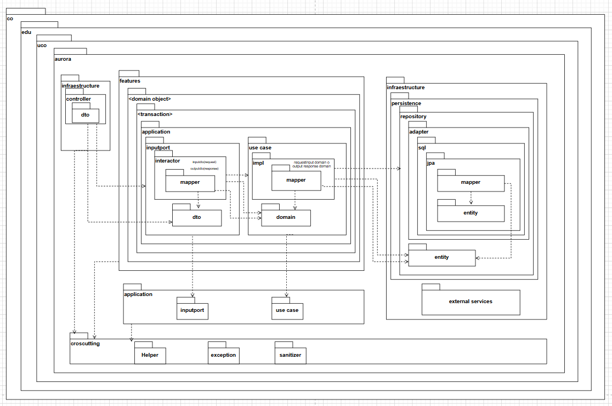
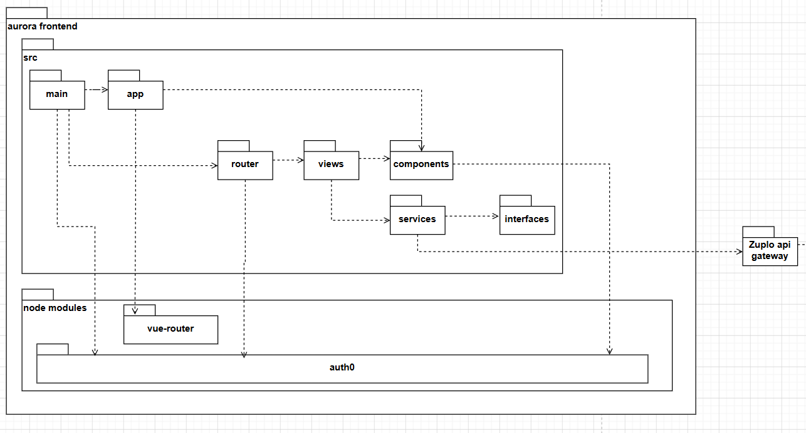
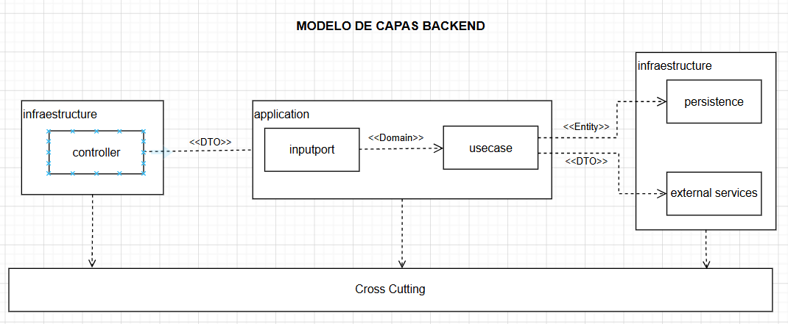
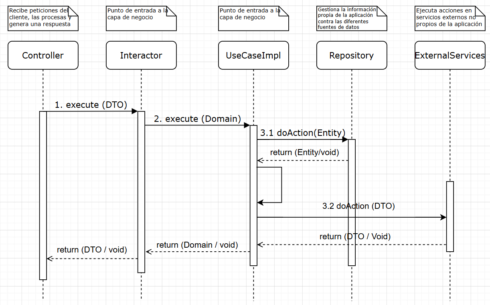
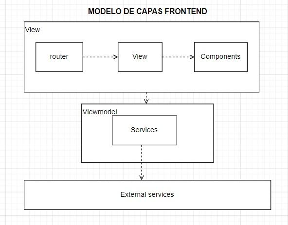
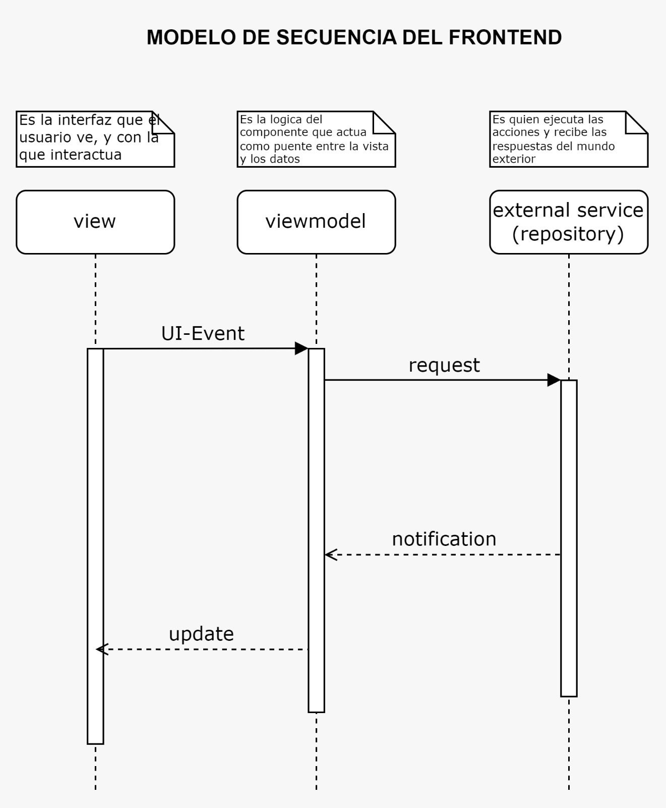
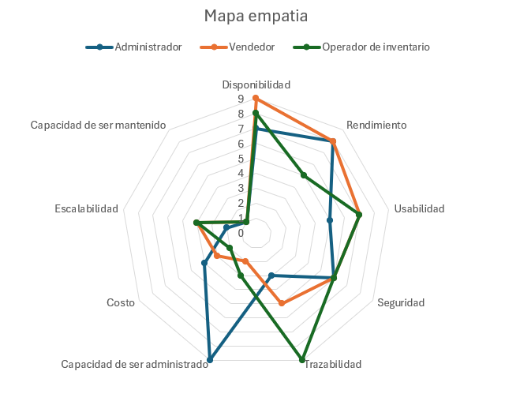

# **Documento de Arquitectura de Software**

## **Aurora**

**Integrantes:**

- [Juan Pablo Alzate Pulgarin]
- [Maria Camila Diaz Pinilla]

---

## **Introducción**

**Aurora** es una aplicación web diseñada para la gestión de inventario de pequeñas ferreterías en Colombia, permitiendo centralizar el control de ventas, clientes, inventario por lotes y fechas de vencimiento, y la administración de los empleados del negocio en una sola plataforma, eliminando la dependencia de hojas de cálculo y registros manuales.

Este documento describe la arquitectura de Aurora desde los siguientes puntos, siendo:

- **Despliegue:** define los componentes adoptados y desarrollados que conforman la solución, su ubicación dentro de la infraestructura y el como se relacionan entre ellos.
- **Componentes:** presenta los módulos lógicos del backend y el frontend, detallando las responsabilidades de cada uno y cómo se comunican entre sí para soportar la operación del sistema.
- **Paquetes:** describe la organización interna del código bajo una arquitectura en capas, estableciendo las dependencias permitidas entre ellas y los límites que garantizan la mantenibilidad y escalabilidad del sistema.
- **Secuencias:** muestra la interacción general de la arquitectura con las capas anteriores, con el fin de generar un entendimiento del flujo que se sigue por cada transacción que puede involucrar o no retorno de datos.

## **1. Diagrama de Despliegue**

### **1.1 Descripción General**

El diagrama de despliegue representa la arquitectura física y lógica de Aurora, mostrando los servicios adoptados y desarrollados, así como su interacción.

Para esto, se tienen sus componentes princapales y posteriormente las bloques de construcción seleccionados para cumplir con cada componente

---

## **1.2 Componentes del Despliegue**

### **1.2.1 Componentes Principales Adoptados**

| Componente | Justificación |
| --- | --- |
| **Static Site Hosting** | Este componente actúa como el entorno de alojamiento especializado para el Frontend, enfocado exclusivamente en servir sitios web estáticos. A diferencia de los servicios de almacenamiento de objetos tradicionales o de propósito general, como por ejemplo un Bloc Store, los cuales requieren una configuración manual más compleja para que una aplicación web  funcione correctamente, una solución nativa de Static Site Hosting entiende por diseño que está sirviendo una aplicación web y gestiona todas estas configuraciones de forma automática. Dado que el Frontend se compone de archivos estáticos (HTML, CSS, JS) que el navegador del usuario descarga y ejecuta localmente, no requiere de un contenedor activo ni de poder de cómputo continuo, como sí lo necesitaría el Backend. Esto convierte al Static Site Hosting en la solución arquitectónica más eficiente, coherente y económica para el despliegue de la interfaz de usuario. Además, ayuda a cumplir los siguientes drivers arquitectónicos: ESC-CAL-DIS-0001, ESC-CAL-DIS-0002, RN-PRE-002 y RN-PRE-003 |
| **Web Application Firewall (WAF)** | El WAF es esencial para Aurora dado que el sistema maneja información sensible del negocio como ventas, inventario, precios de compra y venta, credenciales de los empleados y datos de los clientes. Este componente actúa como primera línea de defensa, interceptando solicitudes maliciosas antes de que siquiera alcancen el API Gateway, esto dado que Aurora es una aplicación web accesible desde internet, la exposición a estos tipos de ataques es un riesgo real, por lo que el WAF garantiza la reducción de la exposición del sistema ante ataques que puedan comprometer la integridad de los datos de la ferretería y ayuda a cumplir los siguientes drivers arquitectonicos: ESC-CAL-DIS-0001, ESC-CAL-SEG-0001 y RN-LEG-001. |
| **Identity Manager** | El Identity Management es esencial para Aurora para garantizar que al sistema solamente ingrese personal autorizado, ademas de hacer que cada empleado acceda únicamente a los módulos y funcionalidades correspondientes a su rol (Administrador, Vendedor u Operador de Inventario), este bloque es el que hace posible toda la logica del manejo del control de acceso al sistema. Cuando un usuario inicia sesión, el Identity Manager valida sus credenciales y si estas son validas, emite un token JWT firmado que incluye su identidad y rol, el sistema valida la identidad del usuario en cada petición posterior al API Gateway, por lo que este le permitira finalmente interactuar y realizar peticiones al sistema, por lo que este bloque evitando que cualquier persona no autorizada, no pueda entrar a la apliacación e interactue con la información del negocio, ademas de que ayuda a cumplir los siguiente drivers arquitectonicos: ESC-CAL-SEG-0001, ESC-CAL-SEG-0002, ESC-CAL-SEG-0003 y RN-LEG-001. |
| **API Gateway** | El API Gateway es un componente crítico en Aurora, es el guardián central del sistema, ya que toda la comunicación entre la interfaz del usuario de la ferreteria y la lógica del negocio pasa obligatoriamente por este componente, siendo que sus responsabilidades en el sistema son: validar el token JWT emitido por el Identity Manager antes de permitir el acceso a cualquier recurso, evitando la exposición directa de los servicios internos, ademas de gestionar el rate limiting para proteger el backend ante picos de tráfico, y centralizar el versionamiento de la API, ya que es el unico punto de acceso hacia la logica de negocio del sistema, ademas de que ayuda a cumplir los siguientes drivers arquitectonicos: ESC-CAL-DIS-0001, ESC-CAL-DIS-0002, ESC-CAL-SEG-0002, ESC-CAL-ESC-0007, RT-MAR-002, RT-DEV-002 y RN-PRE-002. |
| **Application Performance Monitoring (APM)** | La instrumentación y monitoreo son esenciales, ya que en la documentación de  nuestro sistema definimos compromisos precisos de rendimiento y disponibilidad que deben poder verificarse objetivamente, por lo que el monitoring es el bloque que hace posible esa verificación, esta tiene una naturaleza de observación al backend y al API Gateway, recibiendo metricas de forma pasiva sin interrumpir el flujo de las operaciones del negocio, permitiendo detectar de forma temprana degradaciones de rendimiento, caídas de servicios o anomalías en el consumo de recursos. Gracias a esta capa, es posible verificar en tiempo real que los tiempos de respuesta definidos en la matriz de tiempos se estén cumpliendo, identificar el origen de fallos sin depender del reporte del usuario y garantizar que el sistema se ha mantenido disponible durante el horario laboral de la ferretería, ademas de ayudar a cumplir los siguientes drivers arquitectonicos: ESC-CAL-REN-0001, ESC-CAL-DIS-0001, ESC-CAL-DIS-0002 y RT-DEV-001. |
| **PaaS (Plataform as service)** | La Plataforma como Servicio (PaaS) es el entorno gestionado que se encarga de alojar, ejecutar y administrar el ciclo de vida de las aplicaciones del sistema, en nuestro caso, el de nuestro Backend. Este componente abstrae la complejidad de la infraestructura subyacente, proporcionando el entorno automatizado necesario para que los artefactos de software (que contienen la lógica de negocio, dependencias y configuraciones) funcionen correctamente. La plataforma se encarga de proveer los recursos, levantar los servicios, supervisar su ejecución y reiniciarlos automáticamente en caso de fallos. Al delegar el despliegue y la ejecución a través de esta capa, se garantiza una alta consistencia en el comportamiento del sistema entre los entornos de pruebas y producción, mitigando errores derivados de incompatibilidades de entorno. Además, simplifica drásticamente el proceso de integración y despliegue de nuevas versiones, permitiendo una recuperación ágil ante incidentes y asegurando que el sistema mantenga un entorno de ejecución limpio, estable y fácil de operar sin la necesidad de administrar servidores manualmente, además de ayudar a cumplir los siguientes drivers arquitectónicos: ESC-CAL-REN-0001, ESC-CAL-DIS-0001, ESC-CAL-DIS-0002, ESC-CAL-ESC-0007, RT-DEV-001, RT-DEV-002 y RN-TIE-003. |
| **Database** | a base de datos es el núcleo de información de Aurora y el componente que garantiza la integridad de los datos del negocio almacenando ventas, inventario, lotes, clientes, usuarios, trazabilidad y auditoría. Al ser relacional, permite definir restricciones de integridad referencial, garantizando la consistencia de los datos del negocio incluso en operaciones concurrentes de múltiples usuarios simultaneamente, ademas de ayudar a cumplir los siguientes drivers arquitectonicos: ESC-CAL-DIS-0001, ESC-CAL-TRA-0011, ESC-CAL-ESC-0007, RF-VEN-06 y RN-PRE-002. |
| **Cache** | El caché de datos es fundamental para que Aurora almacene temporalmente información consultada con alta frecuencia, como por ejemplo el catálogo de productos, que son de los datos más consultados en el sistema, cuando multiples usuarios operan de manera simultanea, estas consultas pueden saturar el servicio de base de datos y degradar los tiempos de respuesta. El caché almacena temporalmente los resultados de búsquedas frecuentes en memoria RAM, lo que ayuda  que se evite saturar la base de datos con solicitudes, mantener los tiempos de respuesta acordados a lo estipulado en la matriz de tiempos, ademas de ayudar a cumplir los siguientes drivers arquitectonicos: ESC-CAL-REN-0001, ESC-CAL-DIS-0001, ESC-CAL-ESC-0007, RT-DIS-002. |
| **Notification Gateway** | El Notification Gateway abstrae el canal de envios de correos del BackEnd, cuando el BackEnd necesita enviar un correo, como cuando se le enviaria un código de recuperación de contraseña cuando el usuario se le olvido su contraseña, le delega esta responsabilidad al Notification Gateway sin preocuparse por los protocolos, las credenciales del servidor de correo, los reintentos ante fallos y en general todo el manejo de la logica necesaria para el envio de correos. Esto mantienen al backend limpio y enfocado unicamente en la lógica de negocio, ademas de ayudar a cumplir los siguientes drivers arquitectonicos: RF-SEG-06, RN-PRE-001, RT-DIS-001. |
| **Key Vault** | El Key Vault funciona como la bóveda centralizada de Aurora para custodiar la información sensible de infraestructura que no debe almacenarse en el código fuente. Específicamente, almacena las credenciales de conexión a la base de datos y las credenciales de acceso hacia las demas APIs y servicios que usa la aplicación. Al centralizar estos secretos, el sistema separa la lógica del negocio de la gestión de configuraciones críticas, garantizando que el Backend acceda a los servicios de forma segura y auditable, evitando fugas de información y facilitando la rotación de contraseñas sin necesidad de modificar el código del BackEnd, ademas de ayudar a cumplir los siguientes drivers arquitectonicos: ESC-CAL-DIS-0002, RN-LEG-001, RT-DEV-002, RT-DIS-001. |
| **CI/CD Pipeline** | Aurora establece por propender a la adopción de integración continua, entrega continua y despliegue continuo, el CI/CD Pipeline es el bloque de construcción que hace esto posible, es la infraestructura que construye, prueba y entrega el sistema, cada vez que el equipo sube cambios al repositorio, el pipeline ejecuta automáticamente los tests unitarios y de integración antes de permitir que el código llegue a producción, construyendo la imagen del contenedor donde estara alojado el artefacto, ademas de permitir revertir los cambios a una versión anterior si algo llegara a fallar, ademas de ayudar a cumplir los siguientes drivers arquitectonicos: ESC-CAL-DIS-0001, ESC-CAL-DIS-0002, RT-DEV-001, RT-MAR-001, RN-TIE-003. |
| **Message Catalog** | El Catálogo de Mensajes centraliza todas las notificaciones, advertencias y mensajes del sistema.Para Aurora es importante gestionar esta gran cantidad de mensajes fuera del código fuente, para garantizar que la comunicación con el usuario sea estandarizada y clara ante cualquier eventualidad. Además, permite al equipo actualizar o corregir los textos sin la necesidad de modificar el código, recompilar o hacer un nuevo despliegue del backend, manteniendo la lógica de negocio limpia, ademas de ayudar a cumplir los siguientes drivers arquitectonicos: RT-COD-001, RT-DIS-001, RN-ALC-001. |
| **Parameter Catalog** | El Catálogo de Parámetros es el componente que almacena y organiza los datos variables del negocio que el sistema necesita para construir sus plantillas, como el identificador de una venta, el nombre de un empleado o la fecha de vencimiento de un lote. Sin este catálogo, esos datos estarían dispersos por el código, haciendo difícil su mantenimiento y propensos a errores. Al centralizarlos en un solo lugar y tenerlos validados por el compilador antes de ejecutarse, Aurora garantiza que la información que se muestra al usuario siempre sea correcta y consistente, sin necesidad de infraestructura adicional, y además ayuda a cumplir los siguientes drivers arquitectónicos: RT-COD-001, RT-DIS-001, RN-ALC-001. |
| **Notification Catalog** | El Catálogo de Notificaciones es el componente que centraliza todas las comunicaciones que Aurora envía a los usuarios, como la confirmación de una venta, una alerta de stock bajo o un aviso de producto próximo a vencer. Su valor está en que toda la lógica de cuándo y cómo se envía cada notificación vive en un solo lugar, por lo que si se necesita modificar o agregar una nueva, el cambio se hace ahí sin tocar ningún otro módulo del sistema. Esto mantiene el resto del Backend limpio y enfocado en la lógica del negocio, y además ayuda a cumplir los siguientes drivers arquitectónicos: RT-COD-001, RT-DIS-001, RN-ALC-001. |

### **1.2.2 Componentes Principales de desarrollo propio**

| Componente | Justificación |
| --- | --- |
| **Frontend** | El Frontend es la capa visual e interactiva del sistema, es la que los usuarios de la ferretería utilizaran para operar Aurora en su día a día, por lo que sin una interfaz construida a la medida de los flujos de trabajo reales del negocio, como por ejemplo el modulo de ventas, la gestión de inventario, la administración de reportes y empleados, ningún componente de la lógica de negocio podría ser utilizado por las personas que trabajan en la ferretería, por lo que su existencia es fundamental, porque es quien abstrae toda la complejidad técnica del sistema y la convierte en algo amigable, claro y operativo para los usuarios de la ferreteria, los cuales son los usuarios finales que utilizarán el sistema. Este componente no solo permite interactuar con las funcionalidades del sistema, sino que además es el responsable de presentar toda la información del negocio de manera comprensible: el catálogo de productos, el estado del inventario, las alertas de stock y vencimiento, los mensajes del sistema, los reportes y todo lo que Aurora tiene para ofrecer, por lo que es importante que esa información llegue al usuario de forma clara, en el momento adecuado y sin generar confusión, depende de un buen Frontend construido a la medida. Por todo esto, tener un Frontend bien desarrollado, diseñado específicamente para soportar todo lo que Aurora puede hacer, es esencial para que el sistema cumpla su propósito: brindar a los empleados de la ferretería una forma amigable, intuitiva y eficiente de interactuar con la aplicación y tomar decisiones acertadas sobre el negocio. |
| **Backend** | El Backend es el cerebro operativo de Aurora y el componente central del sistema, osea que es el responsable de procesar y hacer cumplir la gran mayoría de los requisitos funcionales documentados en el proyecto, ademas de la implementanción de  las reglas de negocio de la ferretería, como por ejemplo: el sistema FEFO para la salida de productos perecederos, las alertas automáticas de stock bajo y vencimiento, las validaciones de disponibilidad en tiempo real, el control transaccional del inventario, la gestión de roles y accesos, y todo lo demás que el sistema hace por el negocio, por lo que sin el Backend, o si este no funcionara correctamente, ninguno de los demás componentes adoptados tendría razón de existir, ya que este es el núcleo que le da vida al sistema y que convierte la arquitectura completa de Aurora en una solución real para los problemas de la ferretería. |

---

## **Plataformas Tecnologicas**

### **1.2.3 Bloques de Construcción Adoptados**

| Componente | Fabricante | Nombre Comercial | Versión | Tipo de Licenciamiento | Justificación |
| --- | --- | --- | --- | --- | --- |
| **Static Site Hosting** | Cloudflare | Cloudflare Pages | Última versión estable | Capa gratuita (Freemium) | En Aurora, Cloudflare Pages actúa como el componente de alojamiento del Frontend, siendo una plataforma especializada en servir sitios web estáticos. A diferencia de un Storage Account tradicional como Azure Blob Storage o Amazon S3, que son servicios de almacenamiento de objetos de propósito general que requieren configuración manual de permisos, CORS, tipos MIME y reglas de enrutamiento para que una SPA funcione correctamente, Cloudflare Pages es un servicio de Static Site Hosting que entiende que lo que está sirviendo es una aplicación web y gestiona todo eso automáticamente. Al tratarse de archivos estáticos que el navegador descarga y ejecuta localmente, no requieren de un contenedor activo como sí lo necesitaría el Backend, haciendo de Cloudflare Pages la solución más económica, eficiente y coherente para el alojamiento del Frontend de Aurora. |
| **Web Application Firewall (WAF)** | Cloudflare | Cloudflare WAF | Última versión estable | Capa gratuita (Freemium) | Se seleccionó el WAF (Web Application Firewall) de Cloudflare como la capa de seguridad perimetral para el proyecto Aurora, implementándose como un escudo integral delante de la aplicación alojada en Cloudflare Pages y de los servicios del backend. A diferencia de soluciones como AWS WAF o Azure WAF que requieren configuraciones de red complejas, balanceadores de carga adicionales y generan costos variables por inspección de tráfico, Cloudflare ofrece una protección en el "borde" (Edge) de la red global, esto permite filtrar el tráfico malicioso en nodos cercanos al usuario (como Bogotá y São Paulo) antes de que las peticiones alcancen la infraestructura del sistema, garantizando baja latencia y alta disponibilidad. Su motor de seguridad, basado en inteligencia colectiva global, mitiga automáticamente amenazas críticas como ataques de denegación de servicio (DDoS), inyecciones SQL y Cross-Site Scripting (XSS), protegiendo la integridad de la base de datos y la disponibilidad del catálogo en las ferreterías. La integración nativa con Pages asegura que el entorno del frontend no quede expuesto a ataques maliciosos. Esta elección permite delegar la ciberseguridad crítica a un líder global, manteniendo un control de costos eficiente mediante su modelo freemium y una gestión unificada desde una sola consola. |
| **Identity Manager** | Okta | Auth0 | Última versión estable | Capa gratuita (Freemium) | Se seleccionó Auth0  como la plataforma de gestión de identidades y accesos (IAM) para el proyecto Aurora, destacándose frente a alternativas como AWS Cognito, Azure AD B2C o el desarrollo de un sistema de autenticación propio. A diferencia de AWS Cognito y Azure AD B2C que, aunque son sistemans muy potentes, suelen tener configuraciones más rígidas y están profundamente vinculados a sus respectivos ecosistemas de nube, mientras que Auth0 ofrece una arquitectura cloud-agnostic (agnóstica a la nube) y una experiencia de desarrollador superior con una integración casi instantánea. Su plan gratuito es uno de los más generosos del mercado, permitiendo hasta 25,000 usuarios activos mensuales y el uso de múltiples factores de autenticación (MFA) sin costos iniciales. Frente a la opción de construir un sistema de seguridad propio, Auth0 elimina el riesgo técnico y la complejidad de gestionar de forma segura contraseñas y sesiones, implementando estándares abiertos como OAuth 2.0 y OpenID Connect que garantizan la interoperabilidad entre el frontend en Vue.js y el backend en Spring Boot. Además, proporciona funcionalidades avanzadas de seguridad , como la mitigación de ataques automatizados mediante CAPTCHAs integrados, la detección de accesos anómalos basada en machine learning y la facilidad de implementar inicios de sesión sociales o Single Sign-On (SSO). Esta elección permite al equipo de Aurora delegar la seguridad crítica a un líder de la industria, reduciendo la deuda técnica y garantizando que el sistema sea escalable, seguro y eficiente financieramente. |
| **API Gateway** | Zuplo Inc | Zuplo | Última versión estable | Capa gratuita (Freemium) | Se seleccionó Zuplo como el API Gateway para Aurora por ser una solución nativa en la nube diseñada específicamente para desarrolladores, destacándose frente a alternativas como Kong Community Edition, AWS API Gateway o NGINX. A diferencia de Kong, que aunque es de código abierto requiere la configuración y mantenimiento de una infraestructura Docker adicional con base de datos PostgreSQL o Cassandra para gestionar su estado, Zuplo opera como un servicio completamente gestionado (SaaS) que no requiere ninguna infraestructura adicional. Frente a AWS API Gateway, que genera costos variables por millón de peticiones y ata la solución al ecosistema de Amazon, Zuplo ofrece una capa gratuita permanente con características de nivel empresarial. Su principal ventaja diferencial es su arquitectura edge-native, que ejecuta las políticas de enrutamiento y seguridad en nodos distribuidos globalmente. Integra de forma nativa la validación de tokens JWT emitidos por Auth0, el rate limiting configurable y el versionamiento de la API mediante un archivo de configuración declarativo en el repositorio de GitHub. |
| **Application Performance Monitoring (APM)** | New Relic Inc | New Relic | Última versión estable | Capa gratuita (Freemium) | Se seleccionó New Relic como la plataforma de APM y observabilidad para Aurora, descartando alternativas como Datadog, Dynatrace y AppDynamics. La decisión se fundamenta en su muy buena oferta tanto a nivel economico, como tecnico. A diferencia de Datadog, cuyo modelo de facturación modular cobra por separad, APM y logs, lo que generan costos impredecibles que penalizan proyectos en crecimiento como el nuestro, New Relic centraliza todas estas capacidades en una capa gratuita perpetua de 100 GB mensuales. Frente a Dynatrace, orientado a entornos corporativos complejos con presupuestos dedicados, New Relic ofrece una curva de adopción ágil y un agente Java altamente maduro. Este agente auto-instrumenta Spring Framework y expone métricas detalladas de la JVM (asignación de heap, recolección de basura, estado de hilos) sin modificar una sola línea de la lógica de negocio, bastando con inyectarlo como variable de entorno en el contenedor de Render. Además, su trazado de transacciones conecta latencias de endpoints con las consultas SQL exactas, y su potente lenguaje NRQL permite crear alertas proactivas para flujos críticos (ventas, alertas de stock y vencimientos), garantizando una observabilidad de grado empresarial a costo cero. |
| **PaaS (Platform as a Service)** | Render Inc | Render | Última versión estable | Capa gratuita (Freemium) | Se seleccionó Render como la plataforma PaaS (Platform as a Service) para el despliegue y gestión del ciclo de vida del backend de Aurora, destacándose frente a alternativas como Railway, Heroku o el despliegue manual en Kubernetes/VPS. En Aurora se hace uso en el desarrollo del Back End Java 26 con Spring Boot 4.0.6, siendo estas las versiones de estas tecnolpogias que se usaran para el desarrollo del mismo, por lo que usar herramientas como Railway, nos limitaba el entorno nativo a Java 21, Render elimina esta barrera mediante su soporte de primera clase para Docker. Al proporcionar un Dockerfile en el repositorio, el equipo obtiene control absoluto sobre el entorno de ejecución y la versión exacta del JDK, sin sacrificar las ventajas de una plataforma gestionada. A diferencia del despliegue en un VPS o en Kubernetes que exige una alta carga operativa para gestionar redes y parches del sistema operativo, Render abstrae la infraestructura, permitiendo al equipo enfocarse en la lógica de negocio. Frente a Heroku, que eliminó su capa gratuita, Render ofrece un modelo freemium que se ajusta a las fases iniciales del proyecto para su lanzamiento e implementación, ofreciendonos instancias que garantizan la estabilidad en los tiempos de respuesta. Finalmente, su integración nativa con GitHub cierra el ciclo de CI/CD, automatizando el redespliegue ante cada push a la rama principal y consolidando una entrega continua fluida, moderna y sin fricciones. |
| **Database** | PostgreSQL Global Development Group / Neon Inc | PostgreSQL — Neon Serverless Postgres | 17 | Open Source / Capa gratuita (Freemium) | Se seleccionó PostgreSQL como el motor de base de datos relacional para el proyecto Aurora por su robustez industrial y pleno cumplimiento de las propiedades ACID, esenciales para garantizar la integridad absoluta en transacciones de ventas e inventario. Frente a alternativas como MySQL o MariaDB, PostgreSQL ofrece un soporte superior para tipos de datos complejos y una gestión de transacciones concurrentes mediante MVCC (Multiversion Concurrency Control), lo que permite resolver conflictos de stock en tiempo real, evitando que dos vendedores descuenten la última unidad simultáneamente. Para su alojamiento en la nube se seleccionó Neon como proveedor de PostgreSQL gestionado, destacándose frente a alternativas como Supabase, Render PostgreSQL o Railway PostgreSQL. A diferencia de Render PostgreSQL y Railway PostgreSQL, cuyas bases de datos gratuitas expiran a los 90 y 30 días respectivamente, Neon ofrece una capa gratuita permanente sin fecha de expiración y sin requerir tarjeta de crédito, garantizando la disponibilidad continua del servicio durante todo el ciclo de vida académico del proyecto. Frente a Supabase, que incluye múltiples servicios adicionales que no son requeridos por la arquitectura de Aurora, Neon se especializa exclusivamente en PostgreSQL gestionado, proveyendo exactamente lo que el sistema necesita sin complejidad operativa adicional. La integración con Spring Boot se realiza mediante la URL de conexión estándar de PostgreSQL que Neon proporciona, sin ningún cambio en el código de la aplicación. Su licencia de código abierto elimina costos de adquisición del motor, y el alojamiento en Neon garantiza la disponibilidad permanente de los datos durante el desarrollo y la entrega del proyecto. |
| **Cache** | Redis Ltd | Redis Cloud | Última versión estable | Capa gratuita (Freemium) | Se seleccionó Redis Cloud como la solución de almacenamiento de datos en memoria caché para el proyecto Aurora, destacándose frente a alternativas como Memcached o servicios gestionados costosos como Amazon ElastiCache. A diferencia de Memcached que solo permite almacenar cadenas de texto simples, Redis ofrece soporte nativo para estructuras de datos avanzadas (hashes, listas, conjuntos y strings), lo que permite al Back End en Spring Boot gestionar no solo caché de consultas, sino también sesiones de usuario y colas de eventos de forma eficiente y, frente a soluciones como Amazon ElastiCache, que generan costos por hora desde el primer momento de utilizarce, Redis Cloud ofrece una capa gratuita (Free Tier) totalmente administrada, ideal para la fase de desarrollo y validación del sistema sin inversión inicial. Su integración con el ecosistema Spring Boot es nativa a través de Spring Data Redis, permitiendo mantener los "datos en caliente" fuera de la base de datos relacional principal, reduciendo drásticamente la latencia de respuesta. Esta elección garantiza una experiencia de usuario fluida para las ferreterías, optimizando los recursos de infraestructura y asegurando la escalabilidad del sistema ante picos de tráfico. |
| **Notification Gateway** | Resend Inc | Resend | Última versión estable | Capa gratuita (Freemium) | Se seleccionó Resend como el proveedor del Notification Gateway para el proyecto Aurora, destacándose frente a alternativas como Brevo, SendGrid o Mailgun. A diferencia de Brevo y SendGrid, cuya integración con Spring Boot se realiza mediante configuración SMTP tradicional con JavaMailSender, Resend ofrece una API REST moderna y limpia que simplifica significativamente el envío de correos desde el Backend, eliminando la necesidad de configurar protocolos SMTP, puertos y parámetros TLS de forma manual. Frente a SendGrid y Mailgun, que han acumulado deuda técnica en sus APIs y documentación a lo largo de los años, Resend fue construido desde cero con una experiencia de desarrollo (DX) de primer nivel, con una documentación clara, SDKs modernos y ejemplos específicos para Spring Boot que reducen drásticamente el tiempo de integración. Su plan gratuito de 100 emails diarios y 3.000 mensuales es más que suficiente para el volumen de notificaciones de Aurora en durante su fase de prueba en desarrollo y en producción, siendo la opción más viable y completa para implementar a nuestro sistema. |
| **Key Vault** | Doppler Inc | Doppler | Última versión estable | Capa gratuita (Freemium) | Se seleccionó Doppler como la solución de gestión centralizada de secretos (Key Vault) para el proyecto Aurora, destacándose frente a alternativas como Azure Key Vault, HashiCorp Vault self-hosted o la gestión manual mediante archivos de entorno (.env). A diferencia de Azure Key Vault, que aunque es robusto, requiere registrar la aplicación en Azure Active Directory, configurar manualmente quién puede acceder a qué recursos dentro del ecosistema de Microsoft e integrar librerías propietarias en el código antes de poder leer un solo secreto, Doppler ofrece un proceso de configuración en minutos donde los secretos se inyectan automáticamente como variables de entorno al contenedor sin necesidad de modificar el código de la aplicación. Frente a HashiCorp Vault self-hosted, que requiere un servidor dedicado y experiencia operacional avanzada que el equipo no posee, Doppler es un servicio completamente gestionado con un plan gratuito permanente que cubre la totalidad de los secretos necesarios para Aurora. Frente a la gestión manual con archivos .env, Doppler garantiza que nunca ninguna credencial sensible exista en el repositorio de GitHub ni en el sistema de archivos del servidor, cumpliendo el Factor III del Manifiesto de 12 Factores de Aplicación. |
| **CI/CD Pipeline** | Microsoft Corporation | GitHub Actions | Última versión estable | Capa gratuita (Freemium) | Se seleccionó GitHub Actions como la herramienta de Integración y Entrega Continua (CI/CD) para el proyecto Aurora, destacándose frente a alternativas del mercado como Jenkins, GitLab CI o CircleCI. A diferencia de Jenkins la cual exige aprovisionar, configurar y mantener un servidor dedicado para orquestar los despliegues, lo cual incrementando drásticamente los costos operativos, GitHub Actions ofrece una solución Serverless completamente administrada y, frente a herramientas de terceros como CircleCI, su mayor ventaja competitiva es la integración profunda y nativa con el repositorio donde ya reside el código fuente del proyecto (GitHub), permitiendo una automatización fluida basada en eventos (como commits o pull requests) sin configuraciones externas complejas. Para la arquitectura de Aurora, GitHub Actions actúa como el orquestador perfecto: permite automatizar la ejecución de pruebas del backend en Spring Boot y construir las imágenes en contenedores Docker. A nivel de seguridad operacional, destaca su capacidad para integrarse de manera fluida con un Key Vault; en lugar de almacenar credenciales de forma estática, el pipeline recupera e inyecta dinámicamente las variables de entorno sensibles (como los accesos a Auth0, Redis y la base de datos principal) garantizando un despliegue blindado. A nivel económico, su capa gratuita (Free Tier) proporciona minutos de ejecución y almacenamiento de artefactos más que suficientes para un proyecto en crecimiento, eliminando costos iniciales de licenciamiento. Esta elección garantiza entregas rápidas y confiables, consolidando un flujo de trabajo ágil y seguro. |
| **Message Catalog** | Strapi Solutions SAS | Strapi | Última versión estable | Capa gratuita (Freemium) | Se seleccionó Strapi (Strapi Cloud) como Catálogo de Mensajes para Aurora, descartando alternativas nativas como Spring MessageSource y soluciones SaaS como Contentful o Sanity. El criterio central fue permitir la edición dinámica de los textos del sistema sin requerir un redespliegue del Backend, separando el contenido del ciclo de vida del software y dejando puramente el código para nuestra lógica de negocio. Usar Spring MessageSource (archivos .properties) obliga a ejecutar el pipeline de CI/CD en Render ante cualquier corrección ortográfica, lo cual es ineficiente. Por otro lado, Spring Cloud Config Server exige operar un microservicio adicional, añadiendo una complejidad operativa mayor. Frente a plataformas comerciales como Contentful (cuyo plan base parte de $300/mes) o Sanity (que añade la curva de aprendizaje de GROQ), la capa gratuita permanente de Strapi resulta técnica y económicamente superior, además de ser amigable en su uso para desarrolladores sin mucha experiencia. Su integración con Spring Boot se realiza mediante peticiones REST sobre HTTPS. Para optimizar el rendimiento y evitar cobros extra, los mensajes se almacenan en la caché de Redis Cloud al arrancar el sistema, evitando así comprometer los tiempos de respuesta y respetando los límites del plan gratuito. |
| **Parameter Catalog** | Strapi Solutions SAS | Strapi | Última versión estable | Capa gratuita (Freemium) | Se seleccionó Strapi Cloud como Catálogo de Parámetros para Aurora, descartando el uso de Spring Data JPA + PostgreSQL y AWS Parameter Store. El objetivo fue disponer de una interfaz visual que permita gestionar valores clave del negocio sin intervención técnica ademas de usar una plataforma amigable hacia los pequeños desarrolladores. Usar Spring Data JPA obligaba a crear endpoints administrativos adicionales en el Backend, mezclando configuraciones con datos transaccionales de la logica de negocio. AWS Parameter Store fue descartado por generar dependencia de infraestructura (vendor lock-in). Frente a otros CMS más complejos, la interfaz de Strapi permite modelar esquemas en minutos de forma intuitiva y su capa gratuita cubre perfectamente las necesidades del proyecto. Su integración con Spring Boot se realiza mediante peticiones REST vía HTTPS. Al igual que con los mensajes, los parámetros se consultan al arrancar y se almacenan en Redis Cloud, garantizando disponibilidad inmediata para la lógica de negocio sin latencia adicional y maximizando el rendimiento del nivel gratuito de la plataforma. |
| **Notification Catalog** | Strapi Solutions SAS | Strapi | Última versión estable | Capa gratuita (Freemium) | Se seleccionó Strapi Cloud como Catálogo de Notificaciones para Aurora, descartando la combinación de Thymeleaf + Spring Application Events y plataformas como Storyblok. El criterio principal fue externalizar las plantillas visuales de los correos (HTML) para permitir su modificación sin tocar el código fuente. Usar Thymeleaf convierte un simple cambio de diseño o texto en un correo en un evento técnico que requiere redesplegar toda la aplicación en Render. Frente a Storyblok o Contentful (diseñados para marketing y con altos costos), el modelo estructurado de Strapi y su capa gratuita permanente son ideales para almacenar plantillas transaccionales con variables dinámicas. El Backend consulta la plantilla correspondiente vía HTTPS mediante REST, inyecta los datos dinámicos deseados para el correo y finalmente delega el envío a la API de Resend. Esta arquitectura mantiene el sistema limpio, altamente modular y separa por completo la presentación visual de la lógica de envío. |

---

### **1.2.4 Bloques de Construcción Desarrollados**

| Componente | Fabricante | Nombre Comercial | Versión | Tipo de Licenciamiento | Justificación | Motivación |
| --- | --- | --- | --- | --- | --- | --- |
| **Back End Aurora** (Lenguaje) | OpenJDK | Java | 26.0.1 | Open Source | Se seleccionó Java 26 como el lenguaje de programación del Backend de Aurora por ser la plataforma empresarial más madura y ampliamente adoptada para sistemas de gestión de negocio críticos. Frente a lenguajes interpretados como Python o PHP, Java ofrece tipado estático fuerte y compilación previa que detecta la mayoría de errores antes de llegar a producción, reduciendo drásticamente los fallos en tiempo de ejecución. Comparado con JavaScript (Node.js), cuyo modelo de un solo hilo puede convertirse en cuello de botella ante operaciones transaccionales pesadas y concurrentes como las de un sistema de inventario, Java gestiona la concurrencia mediante un modelo de hilos maduros que lo hace más adecuado para múltiples usuarios operando simultáneamente sobre los mismos datos. Frente a C#, que aunque comparte muchas fortalezas con Java en términos de tipado y rendimiento, su ecosistema está históricamente atado al entorno de Microsoft y Windows, mientras que Java es completamente multiplataforma y agnóstico a la infraestructura. En comparación con lenguajes más modernos como Go, Kotlin o Rust, Java cuenta con el ecosistema de frameworks empresariales más completo del mercado, siendo Spring Boot su exponente principal, lo que reduce el tiempo de desarrollo al proveer soluciones ya construidas para autenticación, transacciones, acceso a datos y APIs REST. Ruby, aunque expresivo, carece del rendimiento y la robustez de tipado necesarios para un sistema con compromisos estrictos de tiempo de respuesta. La elección de la versión 26 permite al equipo trabajar con las mejoras más recientes del lenguaje en cuanto a rendimiento, expresividad y características modernas de la plataforma, garantizando que el sistema sea desarrollado sobre una base tecnológica actualizada y alineada con las tendencias actuales del ecosistema Java. | El propósito de adoptar Java 26 en Aurora es que actúe como la base estructural sobre la cual se construye la totalidad del Backend del sistema. Su rol específico es ser el lenguaje mediante el cual se codifica y ejecuta toda la lógica de negocio de la ferretería: el sistema FEFO, el control transaccional de ventas, las validaciones de stock y todas las reglas que hacen que Aurora funcione de forma correcta y segura. Su tipado estático promueve contratos claros entre componentes, su orientación a objetos facilita la aplicación de los principios SOLID y los patrones de diseño definidos en las restricciones técnicas del proyecto, y al ser el lenguaje nativo de Spring Boot elimina cualquier fricción de integración, permitiendo al equipo enfocarse y concentrarse en las funcionalidades del negocio. |
| **Back End Aurora** (Framework) | Broadcom Inc | Spring Framework | 7.x | Open Source | Se seleccionó Spring Framework como el núcleo fundacional y estructural para el Backend de Aurora, descartando alternativas como el desarrollo puro sobre Jakarta EE. Como el "padre" de todo el ecosistema, Spring Framework proporciona el contenedor de Inversión de Control (IoC) y el patrón de Inyección de Dependencias (DI) que sustentan toda la aplicación. Su ventaja más competitiva radica en su arquitectura modular integral, que centraliza componentes críticos bajo un mismo estándar oficial; por mencionar algunos estarían: Spring Web para la exposición de la API REST, Spring Security para el manejo de autorizaciones con Auth0, y Spring Data para la gestión transaccional de inventarios. Al orquestar este ecosistema a través de Spring Boot 4.0.6, se automatiza la configuración sin perder la robustez del framework subyacente. Además, esta generación de Spring Framework está diseñada con soporte nativo para Java 26, permitiendo aprovechar capacidades y tecnologías modernas, manteniéndose a la vanguardia del avance tecnológico. Frente a competidores más recientes como Quarkus o Micronaut, Spring Framework domina como el estándar empresarial definitivo, ofreciendo la madurez necesaria para delegar la infraestructura y enfocar al equipo en la lógica de negocio de la ferretería. | El propósito de adoptar Spring Framework en el proyecto Aurora es que actúe como el motor estructural y fundacional del Backend. Su rol principal es proveer toda la infraestructura técnica automatizada para el desarrollo y, finalmente, la exposición de las APIs REST para que el mundo exterior pueda interactuar con el backend. Al delegar en este robusto ecosistema tareas complejas de bajo nivel como la inyección de dependencias, la conexión a la base de datos y la gestión de la seguridad, entre muchas otras, el equipo de desarrollo puede enfocarse exclusivamente en programar la lógica de negocio de la ferretería, facilitando y acelerando enormemente la construcción de un aplicativo estable y escalable. |
| **Back End Aurora** (IDE de Desarrollo) | JetBrains | IntelliJ IDEA Community Edition | 2026.1 | Open Source | Se seleccionó IntelliJ IDEA Community Edition como entorno de desarrollo frente a otras alternativas de código abierto como Eclipse, NetBeans o Visual Studio Code por ser uno de los mejores IDEAs estandar a la hora de tranajar con Java. A diferencia de otros como Eclipse o NetBeans, que a menudo requieren configuraciones extensas y una interfaz no tan amigable, IntelliJ ofrece una interfaz más amigable, ademas de que de forma nativa, ofrece un análisis estático de código superior que detecta errores y sugiere mejoras en tiempo real mientras se escribe. Frente a editores ligeros como VS Code, este IDE proporciona una comprensión semántica profunda del proyecto al estar trabajando con el lenguaje Java, facilitando refactorizaciones complejas y seguras, así como una navegación fluida por el código fuente, ademas de su integración nativa con herramientas de construcción como Maven y su excelente soporte para el motor de ejecución de Java, garantiza ofrecer uno de los mejores flujos de trabajo a la hora de realizar proyectos en este lenguaje. | IntelliJ IDEA nos proporciona a nosotros como al equipo de desarrollo, una estación de trabajo unificada para la construcción del sistema Aurora, por lo que su rol es actuar como la interfaz principal de codificación, donde sus herramientas de autocompletado inteligente y depuración servirán como el primer filtro de calidad del sistema. Al ayudarnos a identificar posibles bugs o ineficiencias de manera instantánea, el IDE asegura que el código del Backend sea robusto y cumpla con las mejores prácticas de programación desde su creación, permitiendo que nosotros como equipo nos enfoquemos principalmente en resolver la lógica de negocio del sistema, en lugar de lidiar con problemas de sintaxis. |
| **Back End Aurora** (Análisis de calidad de código) | SonarSource | SonarQube for IDE | 12.2.0 | Open Source | Se seleccionó SonarQube for IDE frente a alternativas de análisis estático como Checkstyle, PMD o SpotBugs por ofrecer la solución de retroalimentación más integral y rápida del mercado directamente en el entorno de desarrollo. A diferencia de Checkstyle (que se limita a convenciones visuales de estilo) o PMD (enfocado únicamente en patrones problemáticos), SonarQube for IDE unifica estas cualidades, brindando detección multidimensional de code smells, vulnerabilidades de seguridad y bugs potenciales mientras se escribe el código. Su mayor ventaja competitiva y técnica es su enfoque "Shift-Left": en lugar de esperar a que el código se envíe a un servidor o a un pipeline de CI/CD para ser evaluado, la herramienta analiza el código en tiempo real (como un corrector ortográfico avanzado), permitiendo al desarrollador solucionar problemas antes del commit. Esto reduce la fricción, evita subir código defectuoso al repositorio y acelera enormemente el ciclo de desarrollo. | El propósito de adoptar SonarQube for IDE en el proyecto Aurora es contar con un guardián automatizado de calidad que acompañe al equipo de desarrollo en tiempo real. Su rol fundamental es inspeccionar el código fuente directamente en el editor, detectando de manera temprana cualquier vulnerabilidad o mala práctica en el instante exacto en que se está programando. Con esta herramienta, se garantiza el cumplimiento de los estándares de Código Limpio (Clean Code) y principios SOLID desde la fase misma de escritura, asegurando la mantenibilidad, seguridad y escalabilidad del sistema de forma proactiva, sin depender de validaciones externas o ejecuciones en la nube. |
| **Back End Aurora** (Seguridad) | OWASP Foundation | OWASP Java HTML Sanitizer | Última versión estable | Open Source | Se seleccionó OWASP Java HTML Sanitizer como la librería de sanitización de entradas de texto para el Backend de Aurora, destacándose frente a alternativas como JSOUP o la validación manual mediante expresiones regulares. A diferencia de JSOUP, cuyo propósito principal es el parsing y manipulación de documentos HTML y no la sanitización de seguridad, OWASP Java HTML Sanitizer fue diseñado específicamente por la comunidad OWASP para eliminar contenido malicioso de las entradas del usuario antes de que sean procesadas o almacenadas. Su integración en Spring Boot es inmediata: se agrega como dependencia en el pom.xml y se invoca directamente en los métodos de servicio que reciben datos del usuario, sin ninguna configuración de infraestructura adicional. Al operar dentro del código del Backend, complementa la protección perimetral del WAF de Cloudflare con una validación en la capa de aplicación, implementando el principio de defensa en profundidad y cubriendo vectores de ataque XSS que podrían evadir el filtrado de red. | El propósito de adoptar OWASP Java HTML Sanitizer en Aurora es garantizar que ningún dato malicioso ingresado a través de los formularios del sistema (como el formulario de creación de clientes) pueda ser almacenado en PostgreSQL y posteriormente ejecutado en el navegador de otros usuarios como un ataque Cross-Site Scripting. Su rol concreto en el proyecto es actuar como el filtro de seguridad que procesa todas las entradas de texto libre antes de que el Backend las persista, asegurando que solo texto plano limpio llegue a la base de datos y sea devuelto al Frontend, protegiendo la integridad de la información del sistema y la seguridad de los empleados de la ferretería que lo operan. |
| **Back End Aurora** (Pruebas de seguridad) | OWASP Foundation | OWASP ZAP (Zed Attack Proxy) | Última versión estable | Open Source | Se seleccionó OWASP ZAP como la herramienta de pruebas de seguridad dinámica (DAST) para el pipeline de CI/CD de Aurora, destacándose frente a alternativas de pago como Burp Suite Pro o herramientas comerciales de escaneo. A diferencia de SonarQube, que analiza el código fuente en busca de vulnerabilidades potenciales, OWASP ZAP realiza pruebas de seguridad activas contra la aplicación en ejecución, simulando ataques reales para detectar vulnerabilidades del OWASP Top 10 como inyecciones SQL, XSS, exposición de datos sensibles o endpoints REST sin protección. Al ser completamente gratuito, de código abierto y ofrecer una imagen Docker oficial, se integra de forma nativa en el workflow de GitHub Actions como un paso automatizado que se ejecuta después de cada despliegue, escaneando la URL del sistema en el servidor de Railway y generando un reporte de seguridad sin intervención manual del equipo. | El propósito de adoptar GitHub es que funcione como repositorio central para todo el código fuente de nuestro sistema Aurora, siendo su rol fundamental, orquestar la colaboración asíncrona del equipo, permitiendo el desarrollo paralelo de funcionalidades, ademas de mitigar conflictos y garantiza la integridad de los componentes desarrollados a lo largo del ciclo de vida del proyecto. Al centralizar el historial de cambios y actuar como el disparador (trigger) de los flujos de automatización, GitHub asegura que cada modificación sea rastreable, reversible y esté sujeta a los estándares de calidad definidos antes de cualquier despliegue. |
| **Back End y Front End Aurora** (Controlador de versiones) | Microsoft Corporation | GitHub | Última versión estable | Capa gratuita (Freemium) | Se seleccionó GitHub frente a alternativas como GitLab o Bitbucket por consolidarse como el estándar actual en la industria y al ser la herramienta que ofrece el ecosistema más robusto para la colaboración técnica entre equipos. A diferencia de otros como GitLab, que suele imponer restricciones más estrictas en sus niveles gratuitos respecto a minutos de cómputo y herramientas de gestión, GitHub proporciona repositorios privados ilimitados y una cuota de 2,000 minutos mensuales en el uso de GitHub Actions. Frente a Bitbucket, GitHub destaca por poseer la comunidad global de desarrolladores más extensa, lo que asegura una disponibilidad inmediata de documentación y soporte en cualquier momento, ademas su factor diferencial  es la integración nativa de todo el ciclo de vida de desarrollo en una sola plataforma, permitiendo controlar todo el ciclo de vida de la aplicación, centralizado en un solo lugar. | El propósito de adoptar GitHub es que funcione como repositorio central para todo el código fuente de nuestro sistema Aurora, siendo su rol fundamental, orquestar la colaboración asíncrona del equipo, permitiendo el desarrollo paralelo de funcionalidades, ademas de mitigar conflictos y garantiza la integridad de los componentes desarrollados a lo largo del ciclo de vida del proyecto. Al centralizar el historial de cambios y actuar como el disparador (trigger) de los flujos de automatización, GitHub asegura que cada modificación sea rastreable, reversible y esté sujeta a los estándares de calidad definidos antes de cualquier despliegue. |
| **Front End Aurora** (Framework) | Evan You (Open Source) | Vue | 3.5.33 | Open Source | Se seleccionó Vue.js frente a alternativas como React o Angular por ofrecer el mejor equilibrio entre un ecosistema integrado y una curva de aprendizaje más amigable. A diferencia de React, la cual opera estrictamente como una librería de renderizado y requiere acoplar herramientas de terceros para el enrutamiento o la gestión de estados (como React Router o Redux), Vue.js proporciona un ecosistema oficial unificado (Vue Router y Pinia), y frente a frameworks robustos pero rígidos como Angular, Vue destaca por no imponer un sistema de módulos complejo, permitiendo una productividad más inmediata y amigable. Además, su patrón arquitectónico de Single File Component (SFC), que encapsula estructura (HTML), lógica (TypeScript/JavaScript) y diseño (CSS) en un solo archivo, resulta altamente intuitivo a la hora de programar. Esta cohesión técnica lo convierte en la opción óptima para maximizar la velocidad de desarrollo considerando los tiempos de entrega y el conocimiento tecnico del equipo de desarrollo. | El propósito de adoptar Vue.js en nuestro proyecto es que actúe como el motor estructural de la capa de presentación de la aplicación, es decir del Front End, lo que veran a diario los usuarios de la ferreteria. Su rol fundamental es orquestar y construir toda la interfaz de usuario interactiva en formato Single Page Application (SPA), abarcando los formularios de ventas, el catálogo de productos, la gestión de empleados, la gestión de inventarios, entre todos los demas. A través de su modelo de componentes, Vue permite aislar cada sección de la interfaz en unidades independientes y reutilizables, facilitando el trabajo en paralelo del equipo sin conflictos de código. Asimismo, su sistema de reactividad nativa será el responsable de garantizar que los cambios de los datos, se reflejen de manera oportuna en las pantallas de los diferentes usuarios de la aplicación. |
| **Front End Aurora** (Internacionalización) | Kazupon / Vue Core Team | vue-i18n | 11.x | Open Source | Se seleccionó vue-i18n como la solución de internacionalización para el Frontend de Aurora por ser la librería oficial del ecosistema Vue.js para la gestión de múltiples idiomas, con integración profunda y nativa con Vue 3 y su API de Composition. A diferencia de implementaciones manuales con objetos JavaScript o librerías genéricas como i18next, vue-i18n ofrece detección automática del idioma del navegador, cambio de idioma en tiempo real sin recarga de página y soporte para formatos de fecha, número y pluralización según la localidad del usuario. Frente a soluciones como FormatJS o LinguiJS, vue-i18n es la opción con mayor adopción y documentación dentro del ecosistema Vue, con soporte oficial del equipo del framework. Si bien Aurora operará inicialmente en español, adoptar vue-i18n desde el inicio garantiza que toda la capa de presentación esté construida sobre una arquitectura preparada para escalar a otros idiomas sin necesidad de refactorizaciones costosas. | El propósito de adoptar vue-i18n en Aurora es construir el Frontend desde su base con capacidad de soportar múltiples idiomas en el futuro, aunque en la primera versión opere exclusivamente en español. Su rol en el proyecto es centralizar todos los textos de la interfaz en archivos de traducción separados de los componentes Vue, garantizando que cuando se requiera agregar un nuevo idioma el cambio se limite únicamente a agregar un archivo de traducciones sin tocar ningún componente de la interfaz. Esto también mejora la mantenibilidad del sistema a corto plazo, ya que cualquier corrección de texto en la interfaz se hace en un solo lugar centralizado y no disperso por decenas de componentes. |
| **Front End Aurora** (Lenguaje) | Microsoft (OpenJS Foundation) | TypeScript | 5.9.3 | Open Source | La elección de TypeScript sobre JavaScript se debe a que JavaScript, al ser un lenguaje de tipado dinámico, deja demasiada libertad a los desarrolladores; TypeScript, en cambio, impone un tipado estático que mejora la robustez, la mantenibilidad y la seguridad del código frontend, debido que el copilador verifica antes de ejecutar el codigo, permite detectar errores incluso antes del que código corra, protegiendo así la integridad de la información que se presenta al usuario. , TypeScript es el estándar en el ecosistema Vue.js, siendo este un JavaScript, pero más moderno, seguro y robusto, con soporte nativo en todos los editores de código y herramientas de construcción del proyecto. | TypeScript cumple el rol en nuestro proyecto de garantizar la integridad de los datos entre el backend y el frontend de Aurora. Al poder definir interfaces TypeScript que representan las entidades del sistema, como por ejemplo serian los Productos, Lotes, Ventas, Clientes, entre otras, el compilador verifica que el frontend acceda únicamente a los campos que existen en la respuesta del backend y con el tipo de dato correcto esperado, esto siendo muy relevante en operaciones del día a día de la ferreteria, ya que un dato mal mostrado, puede generar inconsistencias en el flujo de trabajo de la ferreteria. |
| **Front End Aurora** (IDE) | Microsoft | Visual Studio Code | 1.117.0 | Open Source | Se seleccionó Visual Studio Code (VS Code) como el entorno de desarrollo para la capa del Front End, destacándose frente a alternativas como WebStorm o Atom. A diferencia de WebStorm (de JetBrains), este exige un pago de licencias comerciales comerciales para su uso, mientras VS Code es una herramienta gratuita y de código abierto respaldada por Microsoft, que ofrece buen rendimiento y varias herramientas sin costo. Frente a editores como Atom, el cual fue descontinuado en 2022, VS Code garantiza actualizaciones mensuales, ademas del apoyo de la comunidad de desarrolladores web más grande a nivel global. Su ventaja definitiva para el proyecto Aurora es su ecosistema de extensiones especializado en desarrollo web: ofrece soporte nativo para TypeScript y cuenta con herramientas oficiales como Volar (para el análisis de Vue.js), ESLint y SonarLint, lo que proporciona un análisis de código en tiempo real altamente preciso para el desarrollo del Frontend. | El propósito de adoptar Visual Studio Code es darnos una estación de trabajo ligera, rápida y altamente especializada para la construcción exclusiva del Frontend de muestra aplicación. Su rol fundamental es ser el entorno donde se orquestará toda la interfaz gráfica en Vue.js. Al estandarizar el uso de VS Code específicamente para la capa de presentación, se garantiza que todos los integrantes del equipo trabajen bajo las mismas reglas de formateo, las mismas alertas de calidad de código y la misma integración con el repositorio en GitHub.  Dondonos un entorno ligero, facil de usar, y con todas las herramientas necesarias pára el desarrollo y la construcción del front End de nuestra aplicación. |

---

### **1.3 Diagrama de Componentes del Despliegue - Bloques de construcción**

Este diagrama tambien corresponde al Arquetipo de Referencia de la aplicación.

### **1.3 Diagrama de Componentes del Despliegue - Plataformas Tecnologicas**

Este diagrama tambien corresponde a la Arquitectura de Referencia de la aplicación.

---

## **2. Componentes**

El diagrama de componentes representa la estructura lógica con la que esta construida Aurora, identificando los módulos que componen la solución tanto en el Backend como en el Frontend, así como sus dependencias internas.

### **2.1 Componentes del Backend**

### Diagrama de Componentes del Backend

| Componente | Anotación | Descripción |
| :--- | :--- | :--- |
| **aurora-backend** | `<<jar>>` | Núcleo funcional que contiene la lógica de negocio de la ferretería, exponiendo los servicios a través de una API REST. |
| **Java 26** | `<<jre>>` | Entorno de ejecución (Java Runtime Environment) y lenguaje de programación seleccionado para compilar y ejecutar el sistema. |
| **Spring Framework 7** | `<<framework>>` | Framework subyacente que provee el motor de inyección de dependencias (Inversion of Control) y la arquitectura base del backend. |
| **Spring Boot 4.0.6** | `<<parent>>` | Orquestador principal que autoconfigura el proyecto, provee la estructura inicial y gestiona las versiones de las dependencias. |
| **PostgreSQL 42.7.10** | `<<jar>>` | Controlador (Driver JDBC) requerido para establecer la conexión física entre la aplicación y la base de datos relacional. |
| **mapstruct 1.5.5.Final** | `<<jar>>` | Herramienta de generación de código que automatiza el mapeo y transformación de datos entre Entidades, Dominios y DTOs. |
| **spring-boot-starter-webmvc** | `<<jar>>` | Módulo encargado de exponer y gestionar los endpoints de la API REST para recibir las peticiones HTTP del Frontend. |
| **spring-boot-starter-data-jpa** | `<<jar>>` | Capa de persistencia que maneja el mapeo objeto-relacional (ORM), facilitando las consultas y guardado de datos. |
| **spring-boot-starter-data-redis** | `<<jar>>` | Módulo de integración que permite almacenar y consultar datos de alta recurrencia en la memoria caché de Redis. |
| **spring-boot-starter-security** | `<<jar>>` | Módulo de seguridad base encargado de proteger los endpoints, rutas y gestionar la capa de autenticación general. |
| **spring-boot-starter-oauth2-resource-server** | `<<jar>>` | Módulo específico de seguridad para configurar la aplicación como un Servidor de Recursos, validando tokens JWT. |
| **spring-boot-starter-validation** | `<<jar>>` | Provee validaciones de entrada (ej. campos obligatorios, formatos válidos) antes de que la información llegue a la lógica de negocio. |
| **spring-boot-starter-actuator** | `<<jar>>` | Expone métricas operativas y endpoints de estado (health checks) para que herramientas de monitoreo evalúen el rendimiento. |
| **spring-boot-starter-cache** | `<<jar>>` | Provee la abstracción y configuración base en Spring para habilitar la gestión transparente de la caché en la aplicación. |
| **spring-boot-starter-test** | `<<jar>>` | Entorno integral de pruebas que incluye utilidades y librerías (MockMvc, JUnit, etc.) para simular y probar el comportamiento del sistema. |
| **owasp-java-html-sanitizer** | `<<jar>>` | Herramienta de seguridad encargada de sanitizar las entradas del usuario para prevenir ataques de inyección (como XSS). |
| **resend-java 3.1.0** | `<<jar>>` | SDK oficial del servicio Resend utilizado para la integración y el envío transaccional de correos electrónicos. |
| **springdoc-openapi-starter-webmvc-ui** | `<<jar>>` | Librería encargada de generar y exponer automáticamente la documentación interactiva de la API REST (Swagger UI) siguiendo el estándar OpenAPI. |

### **2.2 Diagrama de Componentes del Backend**

### **2.3 Componentes del Frontend**

| Componente | Anotación | Descripción |
| :--- | :--- | :--- |
| **aurora-frontend** | `<<app>>` | Núcleo interactivo del sistema. Contiene la interfaz de usuario utilizada por los empleados de la ferretería para gestionar ventas, inventario y reportes. |
| **vue 3.5.32** | `<<parent>>` | Framework progresivo principal de JavaScript, utilizado como motor base para construir las interfaces de usuario de forma estructurada por componentes. |
| **typescript** | `<<framework>>` | Lenguaje de programación (superconjunto de JavaScript) que añade tipado estricto, mejorando la detección de errores y la mantenibilidad del código del Frontend. |
| **vue-router 5.0.4** | `<<lib>>` | Librería encargada del enrutamiento en el lado del cliente. Permite la navegación fluida entre los distintos módulos del negocio sin recargar la página completa. |
| **@auth0/auth0-vue 2.6.1** | `<<lib>>` | SDK oficial de Auth0 para Vue. Gestiona el flujo de autenticación (inicio de sesión), la seguridad de las rutas y la administración de los tokens en el navegador. |
| **bootstrap 5.3.2** | `<<framework>>` | Framework de diseño (CSS/JS) utilizado para maquetar la interfaz, garantizando que el sistema sea visualmente consistente y responsivo. |
| **vue-i18n 11.4.4** | `<<lib>>` | Plugin de internacionalización para Vue. Permite gestionar y cambiar dinámicamente los idiomas y las traducciones dentro de la interfaz de usuario. |
| **pinia 3.0.4** | `<<lib>>` | Librería oficial de gestión de estado global para Vue. Se encarga de centralizar, almacenar y compartir datos reactivos entre múltiples componentes. |
| **vite 8.0.8** | `<<DevDependency>>` | Herramienta de compilación (build tool) y servidor de desarrollo. Empaqueta el código, transpila TypeScript y optimiza los recursos para el despliegue a producción. |

### **2.2 Diagrama de Componentes del Frontend**

---

## **3. Diagrama de Paquetes**

### **3.1 Paquetes — Backend**

#### **3.2 Descripción General**

# Documentación del Diagrama de Paquetes - Backend Aurora

El diagrama de paquetes describe la organización interna del Backend de Aurora, propendiendo por hacer uso de la arquitectura **Clean Architecture**

### Diccionario de Paquetes

| Paquete | Paquete Padre | Descripción |
| :--- | :--- | :--- |
| `co` | - | Paquete raíz del proyecto a nivel de país. |
| `edu` | `co` | Paquete correspondiente al sector educativo. |
| `uco` | `edu` | Paquete institucional (Universidad Católica de Oriente). |
| `aurora` | `uco` | Paquete principal que contiene todo el ecosistema del sistema Aurora. |
| `features` | `aurora` | Agrupa el código por módulos o funcionalidades. |
| `<domain object>` | `features` | Representa una entidad principal del negocio (ej. `clientes`, `tipo de identificación`, etc.). |
| `<transaction>` | `<domain object>` | Agrupa los componentes exclusivos de un caso de uso específico (ej. `añadirCliente`, `buscarCliente`). |
| `application` | `<transaction>` | Capa de aplicación local de la transacción. Orquesta el flujo de los datos. |
| `inputport` | `application` | Contiene los puertos de entrada y los DTOs de la petición. |
| `interactor` | `inputport` | Implementación del puerto de entrada, orquesta la ejecución del caso de uso. |
| `mapper` | `interactor` | Convierte los DTOs de entrada en modelos procesables por el caso de uso. |
| `dto` | `inputport` | Objetos de Transferencia de Datos utilizados en la entrada y salida de la aplicación. |
| `use case` | `application` | Define las interfaces e implementaciones de las reglas puras del negocio. |
| `impl` | `use case` | Implementación concreta de la lógica y reglas del caso de uso. |
| `mapper` | `impl` | Transforma modelos intermedios en objetos de dominio y viceversa. |
| `domain` | `use case` | Contiene entidades y reglas propias del dominio. |
| `validator` | `domain` | Validaciones estructurales y de formato específicas del dominio. |
| `rule` | `domain` | Reglas de negocio particulares aplicadas al dominio de la transacción. |
| `infrastructure` | `aurora` | Capa más externa. Contiene adaptadores web, seguridad, persistencia y servicios externos. |
| `security` | `infrastructure` | Configuraciones y componentes de seguridad de la aplicación. |
| `controller` | `infrastructure` | Controladores REST (Adaptadores de entrada) que reciben peticiones HTTP. |
| `dto` | `controller` | DTOs específicos para exponer en los endpoints de la API hacia el Frontend. |
| `persistence` | `infrastructure` | Implementación de acceso a base de datos. |
| `repository` | `persistence` | Interfaces de repositorios y contratos de acceso a datos. |
| `adapter` | `persistence` | Adaptadores concretos que conectan la lógica con la tecnología de base de datos. |
| `sql` | `adapter` | Adaptadores específicos para bases de datos relacionales. |
| `jpa` | `sql` | Implementación de persistencia utilizando el estándar JPA. |
| `mapper` | `jpa` | Convierte entidades de base de datos (JPA) a entidades para su uso en la aplicación. |
| `entity` | `jpa` | Modelos de datos técnicos mapeados a tablas de base de datos (`@Entity`). |
| `entity` | `persistence` | Definiciones base para las entidades de persistencia. |
| `externalservices` | `infrastructure` | Adaptadores para consumir APIs y servicios de terceros. |
| `notification` | `externalservices` | Integración para el manejo y envío de notificaciones del sistema. |
| `messagecatalog` | `externalservices` | Consumo y gestión del catálogo de mensajes de la aplicación. |
| `notificationcatalog` | `externalservices` | Consumo y gestión de configuraciones del catálogo de notificaciones. |
| `parametercatalog` | `externalservices` | Consumo y gestión del catálogo de parámetros del sistema. |
| `adapter` | Servicios Externos | Adaptadores específicos para la comunicación HTTP con cada servicio externo. |
| `mapper` | `adapter` | Transforma las respuestas de los servicios externos a modelos entendibles por Aurora. |
| `dto` | Servicios Externos | Objetos de Transferencia de Datos utilizados para intercambiar información con las APIs de terceros. |
| `application` | `aurora` | Capa de aplicación transversal compartida entre múltiples `features`. |
| `inputport` | `application` | Puertos de entrada genéricos o compartidos. |
| `use case` | `application` | Contratos de casos de uso compartidos en todo el sistema. |
| `rule` | `use case` | Contratos de reglas de negocio transversales y compartidas. |
| `crosscutting` | `aurora` | Componentes transversales reutilizables por todas las demás capas. |
| `Helper` | `crosscutting` | Clases utilitarias generales. |
| `exception` | `crosscutting` | Tipos de excepciones personalizadas y manejo centralizado de errores. |
| `sanitizer` | `crosscutting` | Utilidades de limpieza y validación transversal de datos para evitar inyecciones. |

### **3.3 Imagen del Diagrama de Paquetes — Backend**

### **3.4 Paquetes — Frontend**

#### **3.5 Descripción General**

# Documentación del Diagrama de Paquetes - Frontend Aurora

El diagrama de paquetes describe la organización interna de la aplicación Frontend de Aurora, mostrando un enfoque separando las responsabilidades y la comunicación con el Backend.

### Diccionario de Paquetes

| Paquete | Paquete Padre | Descripción |
| :--- | :--- | :--- |
| `aurora frontend` | - | Paquete raíz del proyecto Frontend. |
| `src` | `aurora frontend` | Directorio principal que contiene todo el código fuente de la aplicación. |
| `router` | `src` | Contiene la configuración de enrutamiento y la lógica de navegación entre las distintas vistas. |
| `views` | `src` | Representa las páginas completas o vistas principales a las que el usuario puede navegar. |
| `components` | `src` | Contiene los componentes visuales e interactivos reutilizables de la interfaz de usuario. |
| `services` | `src` | Encapsula la lógica de negocio, peticiones HTTP y comunicación directa con las APIs del Backend. |
| `i18n` | `src` | Manejo de la internacionalización, conteniendo las traducciones y la configuración de múltiples idiomas. |
| `interfaces` | `src` | Capa transversal que define los contratos de datos, modelos y tipados (TypeScript). Es consumida transversalmente por múltiples paquetes como vistas y servicios. |

### **3.3 Imagen del Diagrama de Paquetes — Frontend**

## **4. Diagrama de Secuencia**

El siguiente diagrama de secuencia muestra la interacción general de la arquitectura con las capas anteriores, con el fin de generar un entendimiento del flujo que se sigue por cada transacción que puede involucrar o no retorno de datos.

### **4.1 Diagramas BackEnd**

#### Modelo De Capas Backend

#### Modelo De Secuencias Backend

### **4.2 Diagramas FrontEnd**

#### Modelo De Capas Frontend

#### Modelo De Secuencias Frontend

---

## **5. Drivers Arquitectónicos**

### **5.1 Matriz de Trade-off (Priorización de Atributos de Calidad)**

**Descripción:** La siguiente tabla define la priorización de los atributos de calidad para el sistema Aurora, donde el número nueve (9) representa el atributo de mayor prioridad y el uno (1) representa el atributo de menor prioridad.

| Atributos de Calidad | 9 | 8 | 7 | 6 | 5 | 4 | 3 | 2 | 1 |
| :--- | :---: | :---: | :---: | :---: | :---: | :---: | :---: | :---: | :---: |
| Disponibilidad | X | | | | | | | | |
| Rendimiento | | X | | | | | | | |
| Usabilidad | | | X | | | | | | |
| Seguridad | | | | X | | | | | |
| Trazabilidad | | | | | X | | | | |
| Capacidad de ser administrado | | | | | | X | | | |
| Costo | | | | | | | X | | |
| Escalabilidad | | | | | | | | X | |
| Capacidad de ser mantenido | | | | | | | | | X |

---

### **5.2Ponderación de Atributos de Calidad por Roles**

#### **5.2.1 Votación de los Atributos de Calidad**

**Descripción:** Esta tabla refleja la votación y el peso relativo (ponderación real) que cada rol principal del sistema (Administrador, Vendedor, Operador de inventario) le asigna a los diferentes atributos de calidad, permitiendo alinear la arquitectura con las necesidades reales de los usuarios.

| Atributos de Calidad | Administrador | Vendedor | Operador de inventario | Total de votos | Ponderación real |
| :--- | :---: | :---: | :---: | :---: | :---: |
| Disponibilidad | 7 | 9 | 8 | 24 | 17,78% |
| Rendimiento | 8 | 8 | 5 | 21 | 15,56% |
| Usabilidad | 5 | 7 | 7 | 19 | 14,07% |
| Seguridad | 6 | 6 | 6 | 18 | 13,33% |
| Trazabilidad | 3 | 5 | 9 | 17 | 12,59% |
| Capacidad de ser administrado | 9 | 2 | 3 | 14 | 10,37% |
| Costo | 4 | 3 | 2 | 9 | 6,67% |
| Escalabilidad | 2 | 4 | 4 | 10 | 7,41% |
| Capacidad de ser mantenido | 1 | 1 | 1 | 3 | 2,22% |
| **Total** | **45** | **45** | **45** | **135** | **100,00%** |

#### **5.2.2 Mapa de Empatía**

---

### **5.3 Escenarios de Calidad Priorizados**

**Descripción:** A continuación se detallan los escenarios de calidad de mayor prioridad para Aurora, los cuales guían las decisiones arquitectónicas para garantizar que el software cumpla con las expectativas de rendimiento, disponibilidad, seguridad, trazabilidad y escalabilidad.

| Código escenario de calidad | Descripción escenario de calidad |
| :--- | :--- |
| `ESC-CAL-REN-0001` | Cada transacción del sistema debe ejecutarse en un tiempo menor o igual al tiempo máximo definido en la matriz de tiempos del sistema. |
| `ESC-CAL-DIS-0001` | Mantener disponible el sistema para los usuarios al menos el 95% del tiempo mensual. |
| `ESC-CAL-DIS-0002` | Cuando se ejecuta un mantenimiento del sistema, el servicio permanece disponible para los usuarios sin interrupciones. |
| `ESC-CAL-TRA-0011` | Al momento de consultar el historial de registros históricos del sistema, el sistema despliega el historial garantizando que todos los registros sean mostrados en formato de solo lectura y no puedan ser alterados ni modificados. |
| `ESC-CAL-SEG-0001` | Iniciar sesión exitosamente con credenciales válidas. |
| `ESC-CAL-SEG-0002` | Al momento de que un usuario intente acceder a un módulo para el cual no posee permisos, el sistema debe rechazar la solicitud, mostrar un mensaje de: "Acceso denegado: Recurso no autorizado" y redirigir al usuario al módulo en que se encontraba antes de la acción. |
| `ESC-CAL-SEG-0003` | Al momento en que un usuario intente acceder por tercera vez al sistema con credenciales inválidas, el sistema debe bloquear la cuenta del empleado durante 10 minutos para prevenir posibles ataques. |
| `ESC-CAL-ESC-0007` | Cuando múltiples empleados utilicen el sistema al mismo tiempo, este debe permitir las operaciones concurrentes de tal manera que todos puedan llevar a cabo sus operaciones de forma satisfactoria. |

---

### **5.4 Especificación de Escenarios de Calidad**

#### **Escenario: ESC-CAL-REN-0001 (Rendimiento)**

| Atributo | Detalle |
| :--- | :--- |
| **Código** | `ESC-CAL-REN-0001` |
| **Nombre** | Cada transacción del sistema debe ejecutarse en un tiempo menor o igual al tiempo máximo definido en la matriz de tiempos del sistema. |
| **Objetivo** | Asegurar que cada una de las transacciones del sistema de la ferretería se ejecute en un tiempo de respuesta menor o igual al tiempo máximo establecido para cada operación dentro de la matriz de tiempos. |
| **Criterio éxito** | Cada transacción ejecutada en el sistema ha respondido en un tiempo menor o igual al tiempo máximo establecido para dicha operación en la matriz de tiempos. |
| **Prerrequisitos** | 1. El usuario debe tener los permisos necesarios para poder realizar la transacción deseada. 2. El sistema debe contar con la información necesaria para ejecutar la transacción deseada. |

**Detalle del Escenario:**

| Fuente del estímulo | Estímulo | Ambiente | Artefacto | Respuesta | Medida de la respuesta |
| :--- | :--- | :--- | :--- | :--- | :--- |
| Cualquier usuario de la aplicación | Ejecución de una transacción específica en el sistema | Operación normal en ambiente productivo | Sistema | El sistema procesa la transacción definida y envía un mensaje indicando que la transacción se ha procesado. | Cada transacción se completó en un tiempo de respuesta menor o igual al tiempo definido dentro de la matriz de tiempos |

---

#### **Matriz de Tiempos del Sistema**

Para dar cumplimiento al escenario `ESC-CAL-REN-0001`, se establecen los siguientes tiempos:

**1. Datos mínimos (Transacciones rápidas)**

| Transacción | Tiempo Máximo | Criterio de rendimiento esperado |
| :--- | :--- | :--- |
| Inicio de sesión | ≤3 segundos por operación | El acceso al sistema debe ser inmediato con credenciales válidas. |
| Registrar nuevo producto | ≤3 segundos por operación | El sistema debe confirmar el registro del producto sin retrasos. |
| Editar producto existente | ≤3 segundos por operación | Los cambios deben guardarse y mostrarse de forma inmediata. |
| Consultar un producto (ej. buscar "Tubo PVC" en el catálogo) | ≤2 segundos por consulta | Los resultados de búsqueda deben mostrarse casi en tiempo real. |
| Registrar una venta | ≤3 segundos por operación | El sistema debe confirmar la venta y actualizar el inventario. |
| Registrar un cliente | ≤3 segundos por operación | El sistema debe confirmar el registro del cliente sin retraso perceptible. |
| Consultar un cliente | ≤2 segundos por consulta | El empleado debe ver la información del cliente de forma inmediata. |
| Actualizar precio de un producto | ≤2 segundos por operación | El nuevo precio debe reflejarse en el sistema sin retraso perceptible. |
| Alerta de vencimiento | ≤2 segundos por operación | La alerta debe generarse y registrarse de forma inmediata al detectar el vencimiento. |
| Registrar nuevo lote de mercancía | ≤3 segundos por operación | El sistema debe confirmar el ingreso del lote y actualizar el inventario sin retrasos perceptibles. |
| Registrar ajuste de inventario a un lote | ≤3 segundos por operación | El ajuste debe guardarse con su trazabilidad (usuario, fecha, motivo) de forma inmediata. |
| Cambiar estado de un producto (Activo/Inactivo) | ≤2 segundos por operación | El cambio de estado debe reflejarse en el catálogo de ventas de forma inmediata. |
| Cerrar sesión del sistema | ≤2 segundos por operación | La sesión debe destruirse de forma casi inmediata al ejecutar el cierre para proteger el acceso. |
| Registrar una devolución de venta | ≤3 segundos por operación | El sistema debe confirmar la devolución y generar el ajuste de inventario compensatorio sin retrasos. |
| Consultar historial de ventas de un cliente | ≤3 segundos por consulta | El historial del cliente debe cargarse de forma inmediata sin interrumpir la atención en el mostrador. |
| Generación automática de alerta de stock bajo | ≤2 segundos por operación | La alerta debe generarse y mostrarse en el dashboard de forma inmediata al detectar el umbral. |

**2. Datos máximos (Transacciones pesadas / Reportes)**

| Transacción | Tiempo Máximo | Criterio de rendimiento esperado |
| :--- | :--- | :--- |
| Consultar historial de ventas (ej. ventas del mes o histórico general) | ≤15 segundos por consulta | El historial debe cargarse sin retraso perceptible independientemente del volumen. |
| Generar reporte de ventas (ej. reporte mensual o por rango de fechas) | ≤10 segundos por operación | El reporte debe completarse sin errores y estar disponible para su revisión. |
| Generar reporte de inventario (ej. reporte de stock actual o productos próximos a vencer) | ≤10 segundos por operación | El reporte debe completarse sin errores y estar disponible para su revisión. |

**3. Datos generales (Resto de transacciones)**

| Transacción | Tiempo Máximo | Criterio de rendimiento esperado |
| :--- | :--- | :--- |
| Todas las demás transacciones del sistema no especificadas en las secciones anteriores | ≤5 segundos por operación | El sistema debe responder en un tiempo máximo de 5 segundos para cualquier transacción no listada explícitamente, ante la incertidumbre de su complejidad técnica real durante el desarrollo. |

---

#### **Escenario: ESC-CAL-DIS-0001 (Disponibilidad)**

| Atributo | Detalle |
| :--- | :--- |
| **Código** | `ESC-CAL-DIS-0001` |
| **Nombre** | Mantener disponible el sistema para los usuarios al menos el 95% del tiempo mensual. |
| **Objetivo** | Garantizar que el sistema se encuentre activo el 95% del tiempo mensual. |
| **Criterio éxito** | El sistema mantiene un nivel de disponibilidad que asegura que se puede realizar cualquier transacción en el sistema durante al menos el 95% del tiempo mensual. |
| **Prerrequisitos** | 1. El usuario debe tener los permisos necesarios para realizar la transacción deseada. 2. El sistema debe contar con la información base necesaria para ejecutar la transacción solicitada. |

**Detalle del Escenario:**

| Fuente del estímulo | Estímulo | Ambiente | Artefacto | Respuesta | Medida de la respuesta |
| :--- | :--- | :--- | :--- | :--- | :--- |
| Cualquier usuario de la aplicación | Realizar cualquier transacción en el sistema | Operación normal en ambiente productivo | Sistema | El sistema responde a la solicitud realizada. | El sistema logra permanecer disponible el 95% del tiempo mensual. |

---

#### **Escenario: ESC-CAL-DIS-0002 (Disponibilidad)**

| Atributo | Detalle |
| :--- | :--- |
| **Código** | `ESC-CAL-DIS-0002` |
| **Nombre** | Cuando se ejecuta un mantenimiento del sistema, el servicio permanece disponible para los usuarios sin interrupciones. |
| **Objetivo** | Garantizar que la ejecución de tareas de mantenimiento del sistema (actualizaciones, respaldos, corrección de errores) no genere interrupciones en el servicio independientemente del momento en que el mantenimiento sea programado. |
| **Criterio éxito** | El mantenimiento del sistema se ha ejecutado exitosamente sin haber generado ninguna interrupción en el servicio. |
| **Prerrequisitos** | _ |

**Detalle del Escenario:**

| Fuente del estímulo | Estímulo | Ambiente | Artefacto | Respuesta | Medida de la respuesta |
| :--- | :--- | :--- | :--- | :--- | :--- |
| Administrador | Llevar a cabo una tarea de mantenimiento (actualización, respaldo, solución de errores). | Operación normal en ambiente productivo | Sistema | El sistema ejecuta las tareas de mantenimiento. | El mantenimiento se completa exitosamente y el sistema permanece disponible sin que los usuarios experimenten interrupciones del servicio. |

---

#### **Escenario: ESC-CAL-TRA-0011 (Trazabilidad)**

| Atributo | Detalle |
| :--- | :--- |
| **Código** | `ESC-CAL-TRA-0011` |
| **Nombre** | Al momento de consultar el historial de registros históricos del sistema, el sistema despliega el historial garantizando que todos los registros sean mostrados en formato de solo lectura y no puedan ser alterados ni modificados. |
| **Objetivo** | Garantizar la integridad y registro de los datos históricos del negocio (transacciones, movimientos de inventario, eventos automáticos del sistema), asegurando que sirvan como insumo exacto de los movimientos del negocio siendo a prueba de manipulaciones, incluso a nivel de base de datos. |
| **Criterio éxito** | El usuario ha consultado el historial de registros históricos y el sistema ha desplegado los registros en modo de solo lectura, previniendo y rechazando cualquier intento técnico o de interfaz para editar, sobreescribir o borrar un registro previamente guardado. |
| **Prerrequisitos** | 1. El usuario debe tener una sesión activa en el sistema. |

**Detalle del Escenario:**

| Fuente del estímulo | Estímulo | Ambiente | Artefacto | Respuesta | Medida de la respuesta |
| :--- | :--- | :--- | :--- | :--- | :--- |
| Cualquier usuario de la aplicación | Consultar el historial de transacciones o registros históricos. | Operación normal en ambiente productivo | Sistema | El sistema despliega el historial de transacciones en formato de solo lectura y envía un mensaje indicando que la consulta se ha procesado. | El 100% de los registros consultados mantienen su información sin modificación, rechazando incluso a nivel de base de datos, cualquier intento de edición y eliminación de la información desde el momento de su creación. |

---

#### **Escenario: ESC-CAL-SEG-0001 (Seguridad)**

| Atributo | Detalle |
| :--- | :--- |
| **Código** | `ESC-CAL-SEG-0001` |
| **Nombre** | Iniciar sesión exitosamente con credenciales válidas. |
| **Objetivo** | Asegurar que un usuario de la ferretería pueda ingresar al sistema de forma satisfactoria únicamente cuando su nombre de usuario y contraseña sean válidos y su cuenta se encuentre activa. |
| **Criterio éxito** | El usuario ha ingresado un nombre de usuario y contraseña válidos y su cuenta está activa, por lo que el sistema le permite ingresar dentro de la aplicación, siendo redireccionado a la página principal de bienvenida del sistema de la ferretería. |
| **Prerrequisitos** | 1. El usuario debe estar registrado en el sistema de la ferretería. 2. La cuenta del usuario debe estar activa y vigente. 3. El usuario no debe tener una sesión activa en el sistema. |

**Detalle del Escenario:**

| Fuente del estímulo | Estímulo | Ambiente | Artefacto | Respuesta | Medida de la respuesta |
| :--- | :--- | :--- | :--- | :--- | :--- |
| Cualquier usuario de la aplicación | Ingresar nombre de usuario, contraseña y ejecutar la acción iniciar sesión. | Operación normal en ambiente productivo | Sistema | El usuario ingresa dentro de la aplicación y es redireccionado a la página principal de bienvenida del sistema. | El usuario ingresado realmente existe con el usuario y contraseña ingresados y, por ende, ingresa a la aplicación y es redireccionado a la página principal de bienvenida de manera exitosa. |

---

#### **Escenario: ESC-CAL-SEG-0002 (Seguridad)**

| Atributo | Detalle |
| :--- | :--- |
| **Código** | `ESC-CAL-SEG-0002` |
| **Nombre** | Al momento de que un usuario intente acceder a un módulo para el cual no posee permisos, el sistema debe rechazar la solicitud, mostrar un mensaje de: "Acceso denegado: Recurso no autorizado" y redirigir al usuario al módulo en que se encontraba antes de la acción. |
| **Objetivo** | Asegurar que un usuario de la ferretería no pueda acceder a un módulo para el cual no posee los permisos requeridos según su rol, de forma que el sistema rechace la solicitud, notifique al empleado y lo redirija a la interfaz en la que se encontraba. |
| **Criterio éxito** | El sistema rechaza la petición solicitada, muestra un mensaje claro explicando que no tiene autorización para acceder a esos recursos y redirige al usuario a la interfaz en que se encontraba antes de realizar la acción. |
| **Prerrequisitos** | 1. El usuario debe tener una sesión iniciada en el sistema. 2. El usuario tiene un rol asignado en el sistema. |

**Detalle del Escenario:**

| Fuente del estímulo | Estímulo | Ambiente | Artefacto | Respuesta | Medida de la respuesta |
| :--- | :--- | :--- | :--- | :--- | :--- |
| Cualquier usuario de la aplicación | El usuario intenta acceder a un módulo para el cual no posee los permisos de acuerdo a su rol. | Operación normal en ambiente productivo | Sistema | El sistema rechaza el acceso, muestra un mensaje y redirige al usuario al módulo previo. | El 100% de los intentos de acceso no autorizados son bloqueados, sin exponer ninguna información o vista parcial del módulo restringido. |

---

#### **Escenario: ESC-CAL-SEG-0003 (Seguridad)**

| Atributo | Detalle |
| :--- | :--- |
| **Código** | `ESC-CAL-SEG-0003` |
| **Nombre** | Al momento en que un usuario intente acceder por tercera vez al sistema con credenciales inválidas, el sistema debe bloquear la cuenta del empleado durante 10 minutos para prevenir posibles ataques. |
| **Objetivo** | Asegurar que el sistema bloquee la cuenta de un usuario de la ferretería durante 10 minutos luego de superar el número máximo de 3 intentos fallidos de inicio de sesión, protegiendo al sistema de posibles ataques. |
| **Criterio éxito** | Tras el tercer intento fallido consecutivo, la cuenta queda inhabilitada temporalmente para iniciar sesión, rechazando cualquier intento de acceso, incluso si luego ingresan la contraseña correcta, hasta que transcurran los 10 minutos. |
| **Prerrequisitos** | 1. El usuario debe estar registrado en el sistema de la ferretería. 2. El usuario ha intentado ingresar 2 veces con credenciales inválidas. |

**Detalle del Escenario:**

| Fuente del estímulo | Estímulo | Ambiente | Artefacto | Respuesta | Medida de la respuesta |
| :--- | :--- | :--- | :--- | :--- | :--- |
| Cualquier usuario de la aplicación | Ingresar una tercera vez con credenciales inválidas. | Operación normal en ambiente productivo | Sistema | El sistema bloquea la cuenta durante 10 minutos y muestra el mensaje "Cuenta bloqueada: has superado el número máximo de intentos". | El 100% de los terceros intentos de iniciar sesión con credenciales inválidas son bloqueados. |

---

#### **Escenario: ESC-CAL-ESC-0007 (Escalabilidad)**

| Atributo | Detalle |
| :--- | :--- |
| **Código** | `ESC-CAL-ESC-0007` |
| **Nombre** | Cuando múltiples empleados utilicen el sistema al mismo tiempo, este debe permitir las operaciones concurrentes de tal manera que todos puedan llevar a cabo sus operaciones de forma satisfactoria. |
| **Objetivo** | Garantizar que se gestionen correctamente los recursos del sistema, permitiendo las operaciones concurrentes de los diferentes usuarios de la ferretería para que todos puedan realizar sus tareas sin degradación del servicio. |
| **Criterio éxito** | Se realizan operaciones de forma simultánea en el sistema exitosamente, manteniendo la estabilidad y permitiendo que todos los usuarios completen sus transacciones de forma satisfactoria. |
| **Prerrequisitos** | 1. Los usuarios deben estar registrados y con sesión activa en el sistema. 2. Los usuarios inician transacciones de forma simultánea. |

**Detalle del Escenario:**

| Fuente del estímulo | Estímulo | Ambiente | Artefacto | Respuesta | Medida de la respuesta |
| :--- | :--- | :--- | :--- | :--- | :--- |
| Cualquier usuario de la aplicación | Dos o más transacciones se realizan en el mismo instante. | Operación normal en ambiente productivo | Sistema | El sistema procesa todas las solicitudes recibidas sin errores de bloqueo. | El sistema soporta las operaciones concurrentes de los múltiples usuarios, de manera que cada uno pueda realizar sus transacciones de manera satisfactoria. |

---

## **6. Funcionalidades Críticas**

**Descripción:** En esto se detallan los requisitos funcionales que se consideran críticos para la operación del sistema Aurora.

| Identificador | Requisito Funcional | Justificación |
| :--- | :--- | :--- |
| `RF-INV-05` | El sistema debe actualizar automáticamente la cantidad total actual del producto en el inventario al agregar o modificar un lote perteneciente al mismo. | La cantidad actual de cada producto es la base sobre la que funcionan varias funcionalidades del sistema, como: las alertas de stock bajo, el estado de agotado, la validación de disponibilidad en ventas y el sistema FEFO. Si esta cifra no se mantiene consistente y actualizada en todo momento, el sistema operaría sobre un dato incorrecto, lo que generaría que se comprometa la integridad de los datos de todo el sistema, haciendo que las decisiones tomadas a partir de ellos no reflejen la realidad del negocio. |
| `RF-INV-10` | El sistema debe generar una alerta visual en el módulo de inventario para los administradores y operadores de inventario cuando un lote perecedero se encuentre a 30, 15 o 7 días de su fecha de vencimiento, asignándole automáticamente el estado 'Próximo a vencer'. | Es fundamental que el sistema notifique con suficiente tiempo de anticipación el vencimiento de los lotes, porque sin esta información el administrador no tiene forma de actuar antes de que el producto caduque, lo que generaría pérdidas financieras por productos vencidos que el negocio no pudo detectar ni tomar medidas a tiempo. |
| `RF-INV-11` | El sistema debe generar una alerta visual en el módulo de inventario para los administradores y operadores de inventario, cuando la cantidad actual de un producto sea menor o igual al stock mínimo configurado para ese producto y asignándole el estado 'stock bajo'. | Es importante porque si un producto se llega a agotar sin previo aviso, los clientes no podrán realizar compras de dicho producto, lo que generaría pérdidas financieras al negocio al no estar vendiendo por falta de stock. Además de esto, afectaría la confianza del cliente al querer realizar próximas compras a futuro. |
| `RF-INV-06` | El sistema debe asignarle automáticamente a un producto el estado 'agotado' cuando este no cuente con más stock en el inventario, siendo que los productos que se encuentren en este estado, no podrán ser seleccionados en nuevas ventas. | Es muy importante que el sistema bloquee automáticamente la selección de un producto agotado en el proceso de venta, porque de lo contrario un vendedor podría iniciar y confirmar una venta con un producto del cual no hay existencia física en la ferretería; esto generaría un compromiso con el cliente que no se puede cumplir, ocasionando pérdida de imagen, conflictos con el cliente y descuadres financieros en la operación diaria del negocio. |
| `RF-INV-12` | El sistema debe asignar automáticamente el estado 'vencido' a cualquier lote el cual su fecha de vencimiento haya superado la fecha límite, siendo que los lotes que se encuentren en este estado no podrán ser seleccionados en nuevas ventas. | Es crítico que el sistema bloquee automáticamente la comercialización de cualquier lote cuya fecha de vencimiento haya sido superada, porque vender un producto vencido a un cliente puede conllevar a problemas legales, pero sobre todo daño a la imagen y reputación del negocio frente a la comunidad y a futuros clientes. |
| `RF-VEN-03` | El sistema debe calcular y mostrar el total de la venta de forma dinámica cada vez que el vendedor agregue, elimine o modifique la cantidad de un producto en el carrito. | Es muy importante que el sistema calcule y muestre de forma dinámica el total de la venta mientras esta se encuentre en proceso, porque de lo contrario el vendedor no tendría visibilidad en tiempo real del valor acumulado de la compra del cliente, llevando a confirmar una venta con un monto incorrecto, generando descuadres financieros, conflictos con el cliente y pérdida de confianza tanto de la ferretería como del sistema como herramienta de gestión del negocio. |
| `RF-VEN-06` | El sistema debe verificar en tiempo real la disponibilidad actual del stock justo antes de confirmar una venta, garantizando que las cantidades solicitadas siguen disponibles en el inventario. | Es crítico verificar la disponibilidad del stock en el instante exacto previo al confirmar la venta porque, entre el momento en que el vendedor agrega un producto al carrito y el momento en que confirma la operación, otro vendedor pudo haber vendido esa misma unidad en otro equipo. Sin esta validación final, el sistema puede confirmar dos ventas del mismo producto con una sola unidad disponible, generando una venta sin respaldo físico real en la ferretería. |
| `RF-VEN-07` | El sistema, en el momento en que un vendedor confirme una venta de un producto perecedero, debe asegurar que se venda un producto del lote próximo a vencer (sistema FEFO — First Expired, First Out). | Es fundamental que el sistema aplique el método FEFO al momento de confirmar una venta, porque de lo contrario se venderían primero los lotes con mayor vida útil y los más próximos a vencer quedarían en bodega hasta caducar, generando pérdidas financieras directas en el negocio, por lo que se debe priorizar que se realice la venta a los productos más próximos a vencer. |
| `RF-VEN-09` | El sistema debe descontar automáticamente del inventario la cantidad vendida de cada producto al momento de confirmar una venta, actualizando la cantidad actual del producto y de los lotes correspondientes al que se descontó. | Es crítico que el inventario se actualice de forma inmediata y automática al confirmarse cada venta, porque de no hacerlo, el stock reflejado en el sistema no correspondería con la realidad física sobre la mercancía verdaderamente existente en el negocio. Esto llevaría al administrador a tomar decisiones de compra basadas en datos incorrectos, generando sobrestock o desabastecimiento, ambos casos conllevando a consecuencias financieras para la ferretería. |

---

## **7. Restricciones Técnicas**

| Tipo | Restricción técnica | Justificación |
|---|---|---|
| Prácticas de diseño | El diseño y desarrollo del software debe propender por seguir los principios SOLID. | El diseño y desarrollo del software de Aurora debe propender por seguir los principios SOLID, asegurando que cada módulo del sistema (productos, inventario, ventas, clientes, reportes y seguridad) tenga una responsabilidad clara y bien delimitada, facilitando que futuras modificaciones o expansiones del sistema no introduzcan fallos en funcionalidades ya operativas de la ferretería. |
| Prácticas de diseño | Se debe propender por la construcción de aplicaciones que sigan los principios del Manifiesto de aplicaciones reactivas | Utilizar el Manifiesto de Aplicaciones Reactivas proporciona una guía fundamentada en principios sólidos para el diseño de sistemas que sean resilientes, escalables y capaz de reaccionar rápidamente a eventos del negocio en tiempo real, como cambios en el stock del inventario, generación de ventas o la generación de alertas de vencimiento. Esto mejora la experiencia de los usuarios de la ferreteria al recibir información confiable y actualizada en tiempo real, contribuyendo a una solución más robusta y eficiente. |
| Prácticas de diseño | Se debe propender el uso de building blocks para la reutilizacion de piezas ya existentes | Se debe propender por el uso de building blocks y componentes reutilizables ya existentes para la construcción del sistema, evitando construir desde cero la solución a un problema el cual que ya está resuelto, permitiendo al equipo enfocarse en la lógica propia del negocio como la gestión de ventas, inventario y alertas. |
| Prácticas DEVOPS | Propender por el uso de prácticas DevOps, relacionadas con las estrategias de integración continua, entrega continua y despliegue continuo | La implementación de DevOps es fundamental para garantizar la entrega continua, la eficiencia operativa y la fiabilidad del sistema, permitiendo que las actualizaciones y correcciones se desplieguen de manera segura y rápida, reduciendo el riesgo de interrupciones de los diferentes servicios de la aplicación, ademas de tambien promueve la escalabilidad y la estabilidad del aplicativo, asegurando una experiencia de usuario óptima y minimizando tiempos de inactividad, para que la aplicación se mantenga disponible y confiable para los usuarios de la ferreteria. |
| Prácticas DEVOPS | Propender por la adopción de los 12 factores de aplicación (Más los 3 extendidos) | El desarrollo de Aurora debe propender por la aplicación de los 12 factores de aplicación, lo que garantiza que nuetro sistema sea portable, escalable y fácil de mantener independientemente del entorno de la ferreteria donde este opere. Esto aplica directamente al sistema en aspectos como la gestión de dependencias del sistema, la separación de la configuración del código fuente, el manejo de logs como flujos de eventos y la correcta administración de los procesos del servidor que soportan las operaciones diarias de la ferretería. |
| Prácticas de código limpio | Se debe propender por aplicación de prácticas de relacionadas con código limpio (Clean Code), evitando Messy Code y Code Smells | Garantiza que la plataforma sea modular, escalable y fácil de mantener, favoreciendo la legibilidad, escritura y comprendiendo del código, reduciendo la posibilidad de errores al dar nombres descriptivos a variables, métodos y clases, lo que tambien impacta directamente en la estabilidad del sistema al tener que realizar a futuro actualizaciones, mantenimientos o nueva creación de funcionalidades al sistema. |
| Patrones de diseño | Propender por el uso de patrones de diseño y de implementación como por ejemplo patrones GoF, GRASP, DRY, KISS. | La adopción de patrones de diseño como lo son GoF, GRASP, DRY y KISS, dentro de nuestro proyecto se justifica por su capacidad para mejorar la calidad del software y facilitar su mantenimiento a lo largo del tiempo. Los patrones GoF promueven la reutilización y la modularidad del código. Los principios GRASP ayudan a asignar responsabilidades de manera clara y coherente en el diseño de clases y objetos, fomentando una estructura más comprensible y adaptable. Por otro lado, los principios DRY (Don't Repeat Yourself) y KISS (Keep It Simple, Stupid) abogan por evitar la duplicación innecesaria de código y por mantener la simplicidad en el diseño, respectivamente, lo que conduce a sistemas más legibles, mantenibles y menos propensos a errores. En conjunto, estas prácticas y principios promueven un desarrollo de software más eficiente, escalable y robusto, asegurando consistencia en el comportamiento del sistema y agilizando la implementación de mejoras sin introducir fallos en funcionalidades críticas. |
| Marco Metodológico | Propender al uso de un controlador de versiones como lo es Git, con repositorios centralizados en GitHub | Todo el código fuente de Aurora debe estar gestionado bajo un sistema de control de versiones utilizando Git, con repositorio centralizado en GitHub. Esto garantiza que nosotros como equipo podamos trabajar de forma colaborativa sin sobrescribir el trabajo del otro, revertir versiones anteriores ante fallos en actualizaciones y mantener un historial completo de la evolución del sistema, lo cual es indispensable para la estabilidad y el mantenimiento de nuestro software a largo plazo. |
| Marco Metodológico | Propender el uso de arquitectura en capas con separación frontend/backend y base de datos | El sistema debe propender construirse bajo una arquitectura en capas que separe claramente la interfaz de usuario (frontend), la lógica de negocio (backend) y la base de datos, comunicándose a través de una API REST. Esta separación garantiza que cambios en la interfaz no afecten la lógica del negocio y viceversa, facilita el mantenimiento independiente de cada capa y permite que el equipo de desarrollo trabaje en paralelo sobre diferentes partes del sistema sin generar conflictos. |

---

## **8. Restricciones de Negocio**

| Tipo | Restricción de Negocio | Justificación | Plan acción |
| --- | --- | --- | --- |
| Humano | El cliente cuenta con una hora semanal para dedicarle al proyecto | El cliente tiene disponibilidad muy limitada para sesiones de validación y retroalimentación dado que debe atender la operación diaria de su ferretería, lo que puede retrasar la toma de decisiones clave y la aprobación de avances del sistema. | Establecer sesiones de validación cortas, focalizadas y programadas previamente, apoyadas en prototipos y documentación clara que permitan al cliente revisar y aprobar avances en el tiempo disponible sin necesidad de sesiones largas o frecuentes. |
| Humano | El cliente es el único tomador de decisiones del negocio y en ocasiones, puede darse el caso que por fuerza mayor, no podrá asistir a sesion semanal clave del proyecto. | Al ser el dueño el único responsable de la ferretería, no puede delegar decisiones operativas del negocio a otra persona. Cuando la operación del negocio lo demande, deberá ausentarse de sesiones del proyecto, lo que puede generar que decisiones importantes queden pendientes de validación y retrasen el avance del desarrollo. | Documentar todas las decisiones tomadas en ausencia del cliente y someterlas a su aprobación en la siguiente sesión disponible. Implementar herramientas de colaboración asincrónica como documentos compartidos o grabaciones de sesiones que le permitan revisar avances sin necesidad de reuniones adicionales. |
| Legal | El proyecto debe garantizar el cumplimiento de la Ley 1581 de 2012 de Protección de Datos Personales. | Aurora almacena datos personales de los clientes de la ferretería como nombre, número de identificación, teléfono y correo electrónico. La Ley 1581 de 2012 obliga a proteger y tratar esa información conforme a la normativa colombiana vigente, siendo una obligación jurídica no negociable cuyo incumplimiento expone al negocio a sanciones legales. | Implementar cifrado de información sensible, control de acceso por roles y políticas claras de manejo de datos, asegurando que el sistema cumpla con los lineamientos básicos de la ley. |
| Legal | El sistema debe operar bajo las normativas comerciales y tributarias Colombianas aplicables al sector ferretero especificamente: el Registro Mercantil ante la Cámara de Comercio y el Estatuto del Consumidor (Ley 1480 de 2011). | La ferretería opera en un entorno regulado por normativas comerciales colombianas. El sistema debe respetar las reglas del negocio sin generar prácticas que puedan derivar en incumplimientos normativos, como el registro incorrecto de transacciones o la omisión de información requerida por regulación. | Validar con el cliente las obligaciones normativas específicas de su negocio antes de iniciar el desarrollo de los módulos de ventas y reportes, asegurando que el sistema registre la información necesaria para cumplir con sus obligaciones. |
| Legal | El sistema debe impedir la comercialización de lotes con fecha de vencimiento vencida, ya que la Ley 1480 de 2011 prohíbe la venta de productos expirados y expone al negocio a sanciones y daño reputacional | En el sector ferretero, productos críticos como cementos, aditivos químicos, pegamentos y pinturas pierden sus propiedades técnicas y de seguridad al expirar. La venta de estos artículos no solo viola la Ley 1480 de 2011, exponiendo a la ferretería a multas de la Superintendencia de Industria y Comercio, sino que también pone en riesgo la integridad de las obras de los clientes y la reputación del negocio. | Implementar el bloqueo automático de lotes vencidos en el proceso de venta como funcionalidad crítica del sistema, garantizando que ningún lote con fecha de vencimiento superada pueda ser seleccionado en una nueva transacción, validando esta lógica mediante pruebas automatizadas antes de la puesta en producción |
| Presupuesto | El proyecto tiene un presupuesto de 12'000.000 de pesos colombianos para el desarrollo del producto | El presupuesto disponible cubre los costos operativos del equipo durante el desarrollo como mantenimiento de equipos, conectividad y servicios necesarios. Este límite condiciona las decisiones tecnológicas y de infraestructura del proyecto, obligando a priorizar soluciones de bajo costo sin comprometer la calidad del sistema. | Priorizar el uso de tecnologías de código abierto. Diseñar una arquitectura modular que permita entregar el MVP (producto minimo viable) dentro del presupuesto disponible, reservando una parte del presupuesto para imprevistos operativos durante el desarrollo. |
| Presupuesto | El sistema debe operar sin incurrir en costos de licenciamiento de software. | Una ferretería pequeña no cuenta con presupuesto para pagar licencias anuales de software. Si el sistema depende de herramientas con costos recurrentes, el negocio no podrá sostenerlo financieramente en el tiempo, haciendo inviable la solución a largo plazo. | Validar con el cliente las obligaciones normativas específicas de su negocio antes de iniciar el desarrollo de los módulos de ventas y reportes, asegurando que el sistema registre la información necesaria para cumplir con sus obligaciones comerciales y tributarias. |
| Presupuesto | La infraestructura de despliegue del sistema no debe superar un costo mensual de $100.000 pesos colombianos para la ferretería | El costo mensual de los servidores necesarios para operar el sistema debe ser accesible para una ferretería pequeña. Si los costos de infraestructura son elevados o impredecibles, el negocio no podrá mantener el sistema activo de forma sostenida, comprometiendo su viabilidad a largo plazo. | Evaluar opciones de infraestructura de bajo costo con planes fijos y predecibles, diseñando el sistema para que su consumo de recursos sea eficiente y proporcional al volumen de operaciones de una ferretería pequeña, manteniéndose dentro del límite mensual acordado. |
| Tiempo | El proyecto cuenta con un tiempo límite desde su inicio el 5 de febrero de 2026 hasta su lanzamiento el 5 de febrero de 2028. | El proyecto tiene una fecha límite de entrega definida, lo que condiciona el alcance de lo que puede construirse y obliga a priorizar las funcionalidades más críticas dentro del tiempo disponible, evitando desviaciones que comprometan la entrega del sistema. | Priorizar el desarrollo del arquitectura evolutiva desde las primeras iteraciones del proyecto, asegurando que los módulos críticos de ventas, inventario y alertas estén operativos antes de abordar módulos de menor impacto en el negocio. |
| Tiempo | Las validaciones con el cliente están sujetas a su disponibilidad, lo que puede generar tiempos de espera entre validaciones. | Si el cliente no puede validar un avance oportunamente, el equipo puede quedar bloqueado esperando aprobación antes de continuar con el siguiente módulo, generando tiempos muertos que afectan el ritmo de desarrollo del proyecto. | Planificar las sesiones de validación con antelación y tenerlas agendadas desde el inicio del proyecto. En caso de que el cliente no pueda asistir, contar con documentación y prototipos que le permitan validar de forma asincrónica sin detener el avance del equipo. |
| Tiempos | La puesta en producción del sistema no puede realizarse en horario comercial de la ferretería para no interrumpir su operación diaria. | La ferretería opera en horario comercial atendiendo clientes de forma continua. Realizar despliegues, actualizaciones o migraciones durante ese horario podría interrumpir las ventas y generar pérdidas al negocio, por lo que cualquier intervención técnica debe realizarse fuera de ese horario. | Planificar todos los despliegues, actualizaciones y migraciones del sistema en horarios no comerciales — noches o fines de semana — coordinando previamente con el cliente para asegurar que la operación del negocio no se vea afectada. |
| Alcance | El cliente no tiene claridad sobre el alcance completo del sistema ni sobre los procesos operativos que desea formalizar. | Dado que el cliente no sabe ni por dónde empezar, definir un alcance cerrado desde el principio generaría un alto riesgo de reprocesos. El sistema debe construirse de forma incremental, priorizando únicamente las funcionalidades mínimas (modulo inventario y ventas) que resuelvan el problema central del negocio y sean completamente funcionales antes de expandir el alcance hacia los demas modulos del sistema. | Aplicar arquitectura evolutiva, construyendo el sistema de manera incremental a partir de un Mínimo Producto Viable (MVP) funcional que resuelva el problema urgente del negocio. El alcance se irá expandiendo iteración a iteración, validando con el cliente en cada entrega para ir descubriendo y formalizando los procesos operativos a medida que el proyecto avanza |
| Alcance | El sistema debe poder ser operado y administrado por el dueño de la ferretería de forma autónoma, sin requerir soporte técnico externo para tareas operativas del día a día. | Una ferretería pequeña no cuenta con personal técnico ni con presupuesto para contratar soporte externo de forma recurrente. Si el administrador del sistema necesita ayuda técnica para realizar tareas básicas como crear usuarios, configurar alertas o generar reportes, el negocio no podrá sostener el sistema de forma independiente en el tiempo. | Diseñar los módulos administrativos con una interfaz clara, autoexplicativa y con mensajes de ayuda contextuales que guíen al administrador en cada proceso, reduciendo al mínimo la necesidad de intervención técnica externa para la operación cotidiana del sistema. |